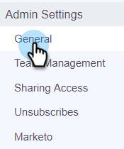

# Blockerade domäner {#blocked-domains}

Hjälp säljteamet att nå framgång genom att förhindra dem från att oavsiktligt skicka e-post till konkurrenter, kända skräppostsvällningar eller någon annan domän som du inte vill kontakta.

>[!NOTE]
>
>**Administratörsbehörigheter krävs**

1. Klicka på kugghjulsikonen i webbprogrammet och välj **Inställningar**.

   

1. Klicka på **Allmänt** under Administratörsinställningar.

   

1. Ange den domän som du vill blockera och klicka på **Blockera domän**.

   

   >[!NOTE]
   >
   >E-postmeddelanden som är en del av en [gruppe-post](/help/marketo/product-docs/marketo-sales-connect/email/using-the-compose-window/sending-emails-via-group-email.md)-sändning som misslyckas på grund av att den skickas till en blockerad e-postdomän misslyckas och visas inte i den misslyckade e-postmappen.
