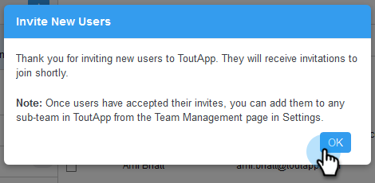

# Bjud in teammedlemmar {#invite-team-members}

Det går snabbt och enkelt att lägga till teammedlemmar!

1. Klicka på kugghjulsikonen och välj **Inställningar**.

   

1. Välj **Teamhantering** under Administrationsinställningar.

   

1. Klicka på **Bjud in ny användare**.

   

1. Ange e-postadresserna till de personer som du vill lägga till och klicka på **Nästa**.

   

   >[!NOTE]
   >
   >Som standard läggs alla nya medlemmar till i gruppen Alla.

1. Klicka på **OK**.

   
