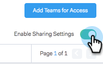

# Delningsinställningar {#sharing-settings}

Hantera mallarna bättre genom att begränsa vad användare kan dela och med vilka kategorier.

När ditt Sales Connect-konto skapas aktiveras delningsinställningarna. Detta ger kontoadministratörer möjlighet att skapa och organisera dina mallkategorier innan de öppnar flödena och ger användarna möjlighet att dela innehåll i era teamkategorier.

När delningsinställningar är aktiverade kan bara administratörer dela i kategorier, såvida inte delningsbehörighet ges till ett team eller alla. Om Delningsinställningar är inaktiverat finns det inga begränsningar och alla användare kan dela i valfria mallkategorier.

## Konfigurera delningsinställningarna {#configure-your-sharing-settings}

1. Gå till sidan Inställningar i [webbprogrammet](http://toutapp.com/login).

   

1. Välj **Delningsåtkomst** under Administratörsinställningar.

   

1. Kontrollera att **Delningsinställningar** är aktiverade. Detta innebär som standard att bara administratörer kan dela mallar i dina mallkategorier.

   

1. Välj den mallkategori som du vill konfigurera.

   

1. Klicka på **Lägg till team för åtkomst**.

   

1. Välj de team som du vill lägga till.

   

   >[!NOTE]
   >
   >Om du inte ser något team måste du gå till Teamhantering och skapa ett team med användare.

1. Klicka på **Lägg till team för åtkomst** för att spara.

   

1. Nu när ditt team har lagts till kan du välja att endast tillåta teamadministratörer att dela eller alla användare i det teamet. I det här exemplet gav vi alla användare på SDR-teamet delningsåtkomst.

   

