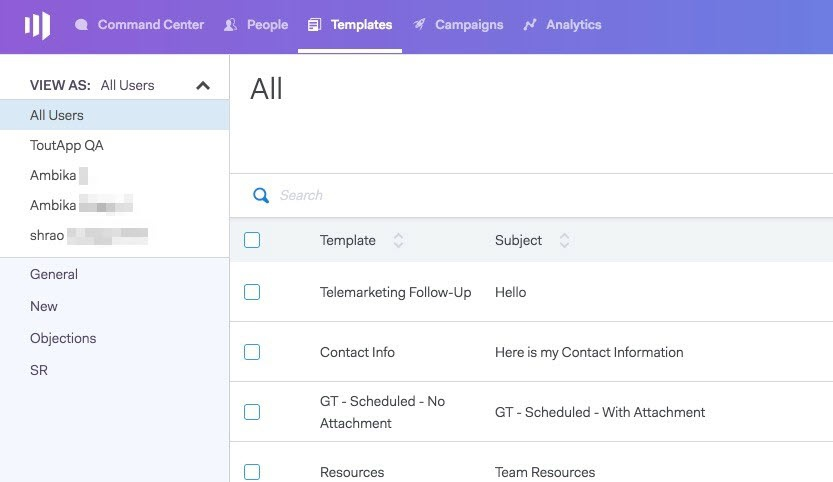
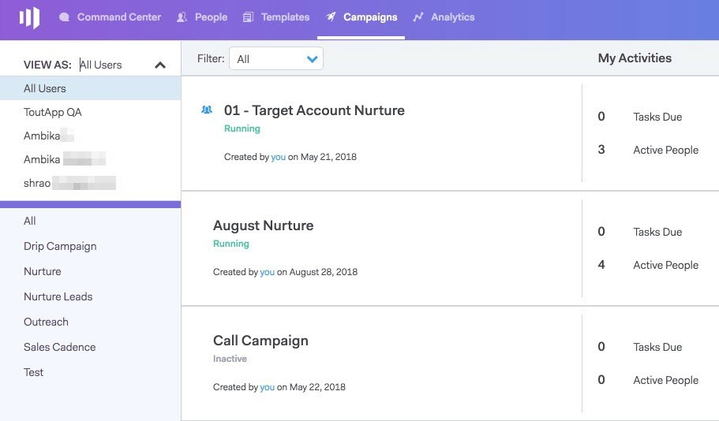
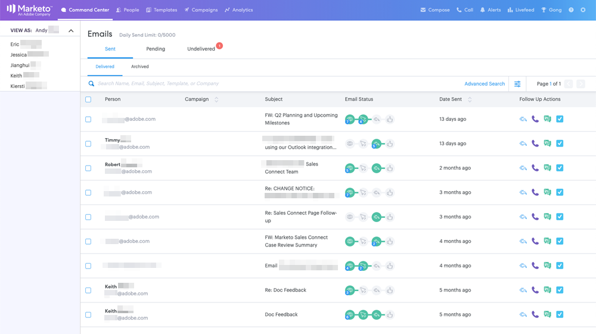
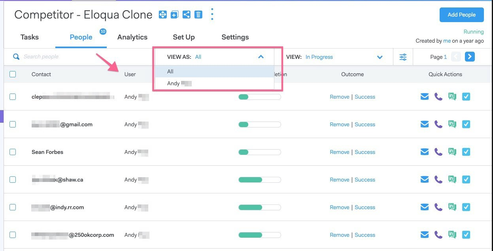
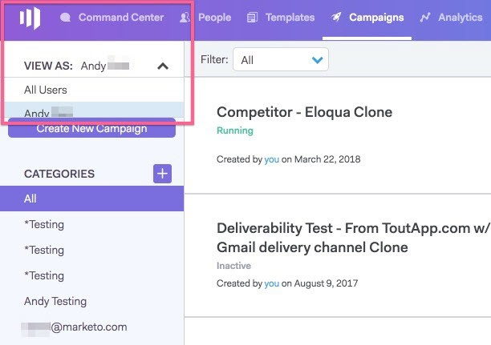

# Information om användaråtkomst {#user-access-details}

Vad har administratörer och icke-administratörer tillgång till?

## Administratörsanvändarbehörigheter {#admin-user-permissions}

Administratörer kan [visa alla mallar](/help/marketo/product-docs/marketo-sales-connect/templates/view-template-list-as-another-user.md).

Administratörer kan [visa alla kampanjer](/help/marketo/product-docs/marketo-sales-connect/campaigns/view-campaigns-list-as-another-user.md).

Administratörer kan visa all e-postaktivitet.

Administratörer kan se alla personer i en pågående kampanj.

Alla personposter är tillgängliga i gruppen Alla.

Administratörer kan stoppa kampanjer för användarnas räkning.

## Behörigheter som inte är administratör {#non-admin-user-permissions}

* Analyser:

   * Användarna kan se teamanalyser
   * Användarna kan fördjupa sig i just de team de tillhör
   * Användarna kan se sina egna analyser

* Relationssida:

   * Användare kan dela grupper med alla
   * Användare kan dela grupper med endast de team de tillhör
   * När en användare tas bort överför deras delade kontakter ägarskapet till huvudadministratören som tog bort användaren

* Säljslag - nästa och direktfeed:

   * Användarna kan se vyn&quot;alla&quot;
   * Användarna kan filtrera efter det team de tillhör
   * Användaren kan dela inlägg med alla
   * Användarna kan dela inlägg med endast de team de tillhör

* Teamhanteringssida:

   * Kan inte visa

* Mallsida:

   * Användare kan dela mallar med alla
   * Användare kan dela mallar i kategorier som deras administratörer tillåter dem att
   * När en användare tas bort från ett team delas inte deras mallar med det teamet
   * När en användare tas bort från ett team överför deras mallar ägarskapet till huvudadministratören som tog bort användaren
