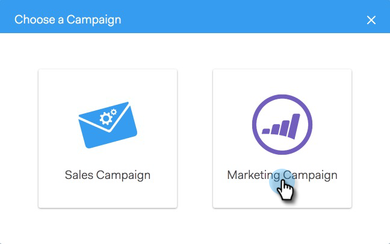

# Lägg till i marknadsföringskampanj {#add-to-marketing-campaign}

>[!PREREQUISITES]
>
>[Gör en kampanj synlig för säljare](http://docs.marketo.com/x/NwDh)

## Lägg till enskilda personer i en kampanj {#add-individuals-to-a-campaign}

>[!NOTE]
>
>Om du vill lägga till en person i en Marketo Campaign från Sales Connect måste Sales Connect ha personens Marketo lead-ID. [Lär dig hur du hämtar Marketo ID:n här](http://docs.marketo.com/x/CQXLAQ).

1. Klicka på fliken **Personer** .

   

1. Hitta de kontakter som du vill lägga till.

   

1. Markera kontakten/kontakterna genom att klicka i kryssrutan.

   

1. Klicka på **Lägg till markerade i kampanj**.

   

1. Eftersom du lägger till i en marknadsföringskampanj går du inte längre till en&quot;från&quot;-adress. Du kan dock välja att lägga till fler kontakter. Om du väljer att göra det klickar du på Individuella och skriver in dem. Klicka på **Nästa** när du är klar.

   

1. Klicka på **Marknadsföringskampanj**.

   

1. Klicka på listrutan Arbetsytor och välj den arbetsyta som innehåller kampanjen som du vill lägga till gruppen i.

   

   >[!NOTE]
   >
   >Om du inte ser den arbetsyta du vill ha kontrollerar du att din administratör har tillgång till den via din Marketo Team Access-sida.

1. Välj önskad kampanj och klicka på **Nästa**.

   

1. Du visas de kontakter som är behöriga. Klicka på **Start** för att lägga till dem.

   

## Lägg till en grupp i en kampanj {#add-a-group-to-a-campaign}

1. Klicka på fliken **Personer** .

   

1. Under Mina grupper väljer du den grupp som du vill lägga till i en kampanj.

   

1. Klicka på **Lägg till grupp i kampanj**.

   

1. Eftersom du lägger till i en marknadsföringskampanj går du inte längre till en&quot;från&quot;-adress. Du kan dock välja att lägga till fler kontakter. Om du väljer att göra det klickar du på Individuella och skriver in dem. Klicka på **Nästa** när du är klar.

   

1. Välj **Marknadsföringskampanj**.

   

   >[!NOTE]
   >
   >Om du vill lägga till en person i en Marketo Campaign från Sales Connect måste Sales Connect ha personens Marketo lead-ID. [Lär dig hur du hämtar Marketo ID:n här](http://docs.marketo.com/x/CQXLAQ).

1. Klicka på listrutan Arbetsytor och välj den arbetsyta som innehåller kampanjen som du vill lägga till gruppen i.

   

   >[!NOTE]
   >
   >Om du inte ser den arbetsyta du vill ha kontrollerar du att din administratör har tillgång till den via din Marketo Team Access-sida.

1. Välj önskad kampanj och klicka på **Nästa**.

   

1. Du visas de kontakter som är behöriga. Klicka på **Start** för att lägga till dem.

   

