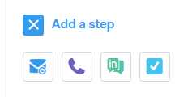

# Typ av kampanjsteg {#campaign-step-types}

När du lägger till ett steg till kampanjen har du fyra alternativ.

## E-post {#email}

Skapa ett nytt e-postmeddelande eller använd en befintlig mall.

| **Använda en mall** | Välj en av dina befintliga mallar |
|---|---|
| **Spara som mall** | Spara e-postmeddelandet som du just komponerade som en ny mall |
| **Lägg till innehåll** | Överför en fil till vår server och få en URL (som pekar på innehållet) som kan spåras i ditt e-postmeddelande |
| **Bifoga filer** | Bifoga en fil från datorn till e-postmeddelandet (storleksgräns 23 MB) |

>[!TIP]
>
>Lär dig mer om dina [sändningsalternativ](http://docs.marketo.com/x/7QDb).

## Ring {#call}

Ställ in en påminnelse om att följa upp med en kontakt via telefon. Du kan också spara anteckningar som ska användas som ett röstspår under samtalet.

## InMail {#inmail}

Uppföljning i flera kanaler är ett bra sätt att få kontakt med leads. Med InMail-uppgifter kan du ställa in en påminnelse som ska nås via LinkedIn.

## Anpassad aktivitet {#custom-task}

Använd anpassade uppgifter när ovanstående alternativ inte är tillämpliga. Du kan till exempel bjuda in en kollega att följa upp med en lead via e-post.

