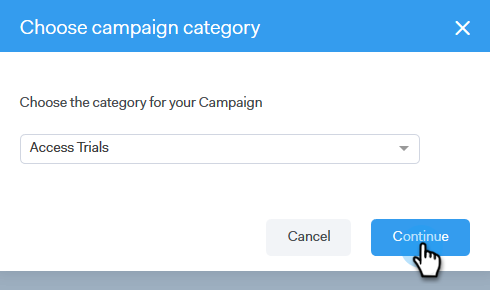

# Skapa en kampanj {#create-a-campaign}

Kampanjerna består av en serie flerkanalsåtgärder, bland annat: e-post, telefonsamtal, InMail och anpassade åtgärder. De gör att ni kan effektivisera kommunikationen med potentiella och befintliga kunder.

Med kampanjer kan ni

* **Ordna**: Effektivisera alla era utåtriktade aktiviteter på ett och samma ställe för effektivt genomförande.

* **Skala**: Schemalägg alla era uppsökande insatser så att ni kan skala om era insatser, minimera det manuella arbetet och personalisera så mycket ni behöver.
* **Mät**: Spåra framgången för alla e-postmeddelanden och uppgifter på ett och samma ställe samtidigt som du automatiskt loggar in dem i Salesforce. Genom att veta vad som är resonerande och leder till resultat kan ni konsekvent testa och förbättra resultaten.

Hur skapar ni en kampanj?

1. Klicka på **Kampanjer** -fliken.

   

1. Välj en kategori och klicka på **Skapa en kampanj** för att skapa en ny kampanj.

   

   >[!NOTE]
   >
   >Skapa en ny kategori genom att klicka på **+** nästa **Kategorier**.

1. Kategorin som du valde markeras. Om du ångrar dig klickar du på listrutan och väljer en annan. När du är klar klickar du på **Fortsätt**.

   

1. Klicka **Lägg till ett steg**.

   

1. Välj mellan: E-post, Samtal, InMail eller Anpassad aktivitet. I det här exemplet väljer vi [E-post](/help/marketo/product-docs/marketo-sales-connect/campaigns/campaign-step-types.md#email).

   

1. När du har skapat din första dag och ditt första steg aktiveras knappen&quot;Lägg till en dag&quot; och du kan lägga till så många dagar och steg som din försäljningsprocess kräver.

   

   >[!NOTE]
   >
   >&quot;Dagar&quot; är inte antalet dagar mellan åtgärder, utan dagen i sekvensen. Om din kampanj till exempel kommer att vara i 7 dagar, innebär &quot;3&quot; att åtgärden kommer att vara i dag 3 av 7, **not** 3 dagar senare.

1. Se till att du anpassar alternativen för schemaläggning och svar, som att hoppa över helger (vilket är fantastiskt), genom att gå till **Fliken Inställningar** för er Campaign.

   

   Nu är det dags att börja lägga till personer i kampanjen!
