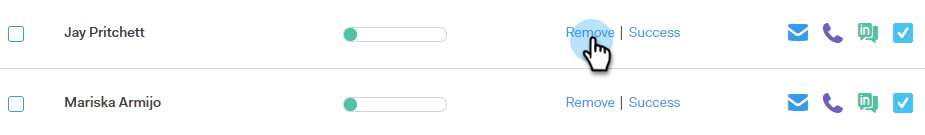
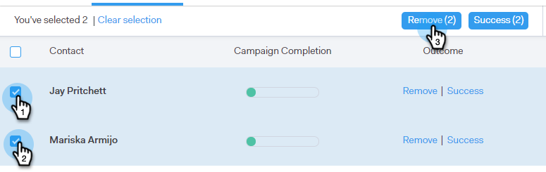
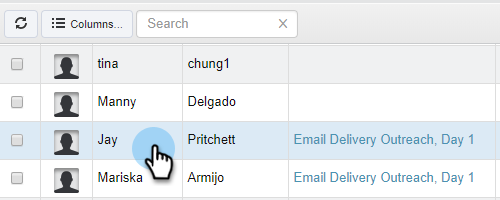
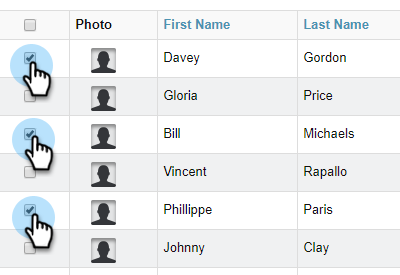

# Ta bort personer från en kampanj {#remove-people-from-a-campaign}

Du kan automatiskt avsluta en kampanj när en mottagare svarar. Och du kan välja att markera Campaign som en&quot;lyckad&quot; för den mottagaren.

När du har skapat kampanjen markerar du bara Avsluta prenumeration i delen Inställningar på fliken Kampanjer. Båda dessa alternativ avslutar kampanjen och mottagaren får inga fler e-postmeddelanden från dig. Du måste ha svarsuppföljning för att detta ska fungera.

Dessutom kan du ta bort personer från själva kampanjen, ta bort personer från en kampanj på sidan Personer och ta bort en hel grupp med personer. Låt oss titta på alla tre metoderna nedan.

## Ta bort en person direkt från en kampanj {#remove-a-person-directly-from-a-campaign}

1. Klicka på fliken **Kampanjer** i Sales Connect.

   

1. Hitta kampanjen och välj den.

   

1. Kampanjen visas till höger. Klicka var som helst på den för att öppna den.

   

1. Leta reda på personen som du vill ta bort och klicka på **Ta bort**.

   

1. (VALFRITT STEG) Du kan också ta bort flera personer samtidigt genom att klicka i kryssrutorna bredvid namnen och klicka på knappen **Ta bort** överst.

   

## Ta bort en person från en kampanj på sidan Personer {#remove-a-person-from-a-campaign-within-the-people-page}

1. Klicka på fliken **Personer** i Sales Connect.

   

1. Sök efter och markera den person som du vill ta bort.

   

1. Panelen Persondetaljvy öppnas till höger. Klicka på fliken **Historik** följt av knappen **Ta bort** .

   

## Ta bort en grupp med personer från en kampanj {#remove-a-group-of-people-from-a-campaign}

1. Klicka på fliken **Personer** i Sales Connect.

   

1. Hitta och markera din grupp under **Mina grupper**.

   

1. Markera de personer som du vill ta bort.

   

1. Klicka på **Åtgärder** och välj **Ta bort markerade från kampanj**.

   

