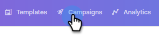

# Hoppa över helger {#skip-weekends}

När ni automatiserar en kampanj vill ni förmodligen inte att era e-postmeddelanden ska skickas ut på en lördag eller söndag. Annars kan du hoppa över helger.

1. Klicka på fliken Kampanjer i Sales Connect.

   

1. Hitta och välj kampanj.

   

1. Klicka på **Inställningar**.

   

1. Markera kryssrutan **Hoppa över helger** .

   

   >[!NOTE]
   >
   >Utan att hoppa över helger schemaläggs e-postmeddelandena baserat på en vanlig 7-dagarsvecka.

