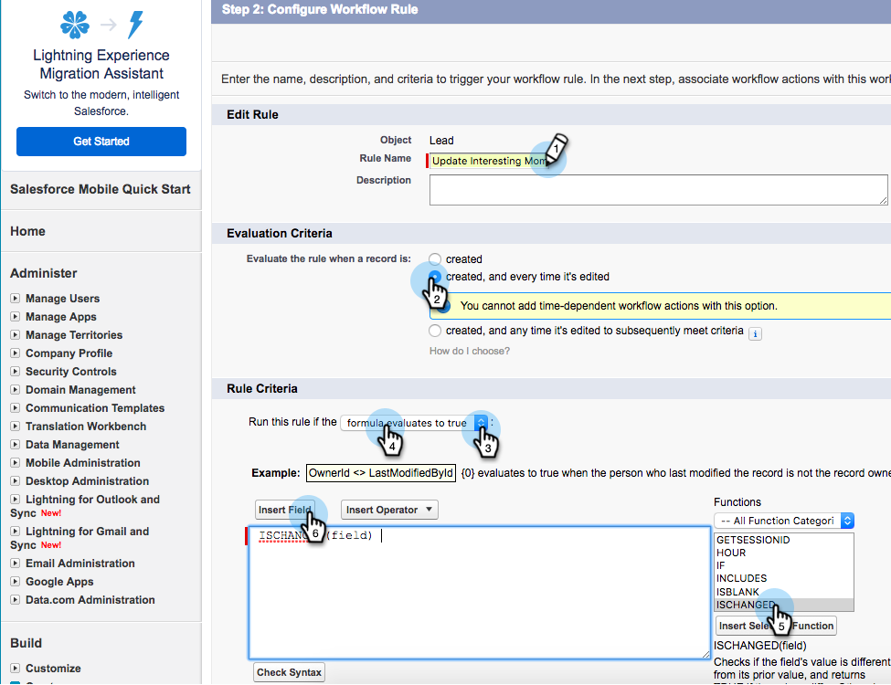

# Skapa arbetsflödesregler i Salesforce {#creating-workflow-rules-in-salesforce}

När du använder Marketo Sales Insight (MSI) och Marketo Sales Connect (MSC) parallellt uppdateras inte MSI Best Bets-funktionen i Salesforce. Alla andra MSI-funktioner fungerar som vanligt (visa intressanta stunder iFrame, skicka e-post, lägga till i kampanjer osv.). I den här artikeln finns en lösning som hjälper dig att få bästa val att fungera igen.

>[!NOTE]
>
>Detta påverkar bara kunder som använder **båda** MSI och MSE, och som vill använda funktionen Bästa val i MSI. Om du inte behöver/använder Bästa val kan du bortse från det.

## Komma igång {#getting-started}

Du kan komma runt problemet genom att skapa nya arbetsflödesregler som kopierar värden från nya MSE-fält till de gamla MSI-fälten. Du måste skapa fyra arbetsflödesregler för Kontakt-objektet och samma fyra arbetsflödesregler för Lead-objektet i din egen Salesforce-instans. Detta kan kräva att du har CRM-administratörsbehörighet (beroende på din roll och konfiguration i CRM).

Nedan visas de rekommenderade namnen på arbetsflödesreglerna och en beskrivning av varje. Dessa gäller för objekten Kontakt och Lead:

<table> 
 <colgroup> 
  <col> 
  <col> 
 </colgroup> 
 <tbody> 
  <tr> 
   <td>Uppdatera fältet Intressant stund</td> 
   <td>
Kopiera från: Senaste Marketo Engagement Desc Kopiera till: Senaste intressanta tillfälle
</td> 
  </tr> 
  <tr> 
   <td>Uppdatera fält för typ av intressant stund</td> 
   <td>
Kopiera från: Senaste Marketo Engagement Type Kopiera till: Typ av senaste intressanta stund
</td> 
  </tr> 
  <tr> 
   <td>Uppdatera fältet Intressanta tidpunkter</td> 
   <td>
Kopiera från: Senaste Marketo Engagement Source Kopiera till: Källa för senaste intressanta stund
</td> 
  </tr> 
  <tr> 
   <td>Uppdatera fältet Intressant datum</td> 
   <td>
Kopiera från: Senaste Marketo-engagemangsdatum Kopiera till: Senaste intressanta datum
</td> 
  </tr> 
 </tbody> 
</table>

## Instruktioner {#instructions}

1. Efter klickning **Inställningar**, sök efter **Arbetsflöde** och markera **Arbetsflödesregler**.

   

1. Välj **Ny regel**.

   

1. Klicka på listrutan Objekt och välj **Lead** och sedan klicka **Nästa**.

   

1. Ange&quot;Uppdatera intressant tillfälligt fält&quot; som regelnamn. Markera alternativknappen **och varje gång det redigeras**. I listrutan Regelvillkor väljer du **formel utvärderas till true**. Sök efter och välj funktionen ISCHANGED. Markera sedan standardfältvärdet och klicka på **Infoga fält**.

   

1. Välj **Senaste Marketo Engagement Desc** och klicka **Infoga**.

   

1. Klicka **Spara och nästa**.

   

1. I listrutan Lägg till arbetsflödesåtgärd väljer du **Ny fältuppdatering**.

   

1. I fältet Namn anger du&quot;Uppdatera intressant tillfälligt dekorfält&quot; (unikt namn genererar automatiskt). I listrutan Fält att uppdatera väljer du **Senaste intressanta tillfälle**. Välj **Använd en formel för att ange nytt värde** alternativknapp, klicka sedan på **Visa formelredigerare**.

   

1. Klicka på **Infoga fält** -knappen.

   

1. Välj **Senaste Marketo Engagement Desc** och klicka **Infoga**. På nästa sida klickar du på **Spara**.

   

1. Klicka **Klar**.

   

1. Klicka **Aktivera** för att aktivera arbetsflödesregeln.

   

   Efter det sista steget kan du välja att klona arbetsflödesregeln för de andra fälten i avsnittet Komma igång: Desc, Type, Source, Date. När du har slutfört de fyra arbetsflödesreglerna i Kontakt-objektet upprepar du det för Lead-objektet.
