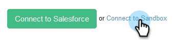

# Ansluta säljanslutning till din Salesforce-sandlåda {#how-to-connect-sales-connect-to-your-salesforce-sandbox}

>[!PREREQUISITES]
>
>Ditt Sales Connect-konto kan inte redan vara anslutet till Salesforce när du upprättar en anslutning till sandlådan. Om det är det [kontrollerar du att du kopplar från](http://docs.marketo.com/x/FoDq) innan du följer stegen i den här artikeln.

1. I Sales Connect klickar du på kugghjulsikonen i det övre högra hörnet och väljer **Inställningar**.

   

1. Klicka på **CRM** under Integrationer.

   

1. Klicka på **Mer info** på Salesforce-kortet.

   

1. Klicka på **Anslut till sandlåda** längst ned på sidan.

   

   >[!NOTE]
   >
   >Om du redan är inloggad på ditt Salesforce-sandlådekonto dirigeras du till en auktoriseringssida där du måste tillåta åtkomst. Om du inte redan är inloggad fortsätter du till steg 5.

1. Ange ditt användarnamn och lösenord för Salesforce-sandlådekontot.

   

>[!MORELIKETHIS]
>
>[Installera anpassningar i din Salesforce-sandlåda](http://docs.marketo.com/x/EIDq)

