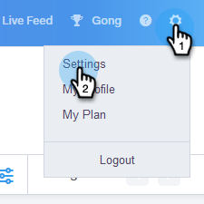

# Installera Salesforce-anpassning för Professional Edition-kunder {#install-salesforce-customization-for-professional-edition-customers}

Kunder som har Salesforce Professional Edition måste följa dessa steg för att installera anpassningar.

>[!PREREQUISITES]
>
>* Sales Connect Admin måste ansluta sina Salesforce- och Sales Connect-konton.
>* Den Salesforce-instans som används måste ha utrymme för att installera tretton anpassade aktivitetsfält.

>

## Installation {#installation}

1. I Sales Connect klickar du på kugghjulsikonen i det övre högra hörnet och väljer **Settings**.

   

1. Klicka på **Salesforce** under Administratörsinställningar.

   

1. Kontrollera att du är ansluten till ditt Salesforce-konto.

   >[!CAUTION]
   >
   >Om du är ansluten visas en grön Install-knapp. **Klicka INTE** på den här knappen, fortsätt till steg 4 i stället.

1. Logga in på Salesforce-kontot som du är ansluten till och klicka sedan på [länken](http://login.salesforce.com/packaging/installPackage.apexp?p0=04t0b000001oWEZ).
1. Du kommer att skickas till installationssidan för Sales Connect.

   

1. Välj de användare som du vill installera anpassningar för: Endast administratör, alla användare eller specifika profiler.
1. Klicka på knappen **Installera** för att installera anpassningar.
1. Logga in på ditt Salesforce-konto för att bekräfta att installationen lyckades.
1. Klicka på **Konfigurera**, sök efter&quot;Installerade paket&quot; i sökfältet och klicka på **Installerade paket**.

   Marketo Sales Connect Customizations visas här.

   Om du vill konfigurera Sales Connect i Salesforce-instansen följer du stegen som börjar i avsnittet&quot;CONFIGURING THE SALES ENGAGE SALESFORCE PACKAGE&quot; på sidan 7 i installationshandboken.

   >[!NOTE]
   >
   >Försäljningsengagemanget är det tidigare namnet för Sales Connect.

   [Installationshandbok för Salesforce Classic](http://s3.amazonaws.com/tout-user-store/salesforce/assets/Marketo+Sales+Engage+For+Salesforce_+Installation+and+Success+Guide.pdf)

   [Installationshandbok för Salesforce Lightning](http://s3.amazonaws.com/tout-user-store/salesforce/assets/SF+Guide+for+Lightning.pdf)

