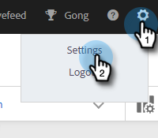
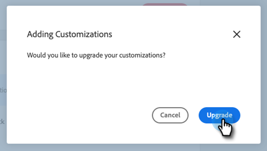
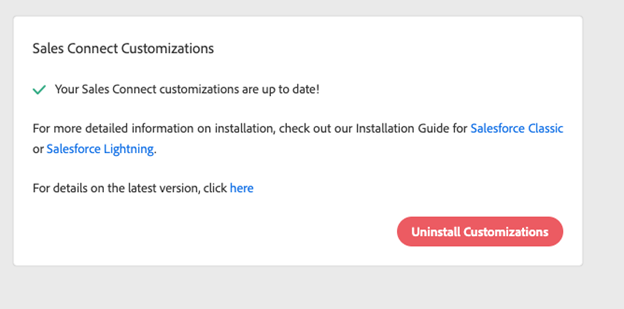

# Anpassningar av Sales Connect för CRM {#sales-connect-customizations-for-crm}

Fälten och knapparna nedan skapas av Metadata API i Salesforce CRM. När fälten har skapats måste administratörer konfigurera sidlayouterna i CRM så att de visas. Instruktioner finns [här](https://docs.marketo.com/display/docs/assets/marketo-sales-engage-for-salesforce-installation-and-success-guide.pdf).

>[!NOTE]
>
>Detta påverkar både ToutApp- och Sales Connect-kunder.

## Installera anpassningar i Salesforce {#how-to-install-customizations-in-salesforce}

1. Klicka på kugghjulsikonen i Sales Connect och välj **Inställningar**.

   

1. Under Administratörsinställningar väljer du **Salesforce**.

   

1. Klicka **Marketo Sales Connect-anpassningar**.

   

1. Klicka **Anslut till Salesforce**.

   

1. Logga in i Salesforce.

   

## Uppdatera Salesforce-anpassning {#update-salesforce-customization}

Uppdateringar av Salesforce-anpassningspaketet kommer att innehålla förbättringar och felkorrigeringar. Följ stegen nedan för att kontrollera om det finns uppdateringar eller för att utföra en uppdatering.

>[!NOTE]
>
>**Administratörsbehörighet krävs.**

1. I [webbprogram](https://www.toutapp.com), klicka på kugghjulsikonen och välj **Inställningar**.

   

1. Under Administratörsinställningar klickar du på **Salesforce**.

   

1. Kortet Sales Connect Customization visar om det finns uppdateringar. Klicka **Uppdatera anpassningar**.

   

1. Klicka **Uppgradera**.

   

1. Vänta tills uppdateringarna har installerats. Installationstiden varierar beroende på hur många versionsnummer du behöver.

   

När kortet är klart visas&quot;Säljarens anpassningar av Connect är uppdaterade.&quot;

## Anpassade aktivitetsfält {#custom-activity-fields}

Marketo kommer att upptäcka att de nya fälten har skapats och sedan göra en engångsefterfyllning av data, en ommappning och en pågående synkronisering av värden till **new** endast fält. Gamla fält uppdateras inte.

| **Fältnamn** | **Beskrivning** |
|---|---|
| MSE-anrop av lokalt närvaro-ID | Som användare kan du välja Lokal närvaro som alternativ när du ringer från MSE-telefonen. Inkommande samtal visar ett lokalt nummer för mottagaren. |
| URL för MSE-samtalsinspelning | Samtal kan spelas in och en länk för inspelningen loggas här. |
| MSE Campaign | Loggnamn för den MSE-kampanj som kontakten/ledningen är medlem i. |
| MSE Campaign URL | Loggar URL till kampanjen som skapades i MSE. Om du klickar på detta öppnas kampanjen i MSE-webbappen. |
| Aktuellt steg för MSE-kampanj | Om en kontakt/lead är en del av en kampanj loggas namnet på det steg som leadet/kontakten är aktiverad för. |
| MSE E-postbilaga visad | Loggar data när ett e-postmeddelande skickas med en bifogad fil och den bifogade filen visas av mottagaren. |
| MSE-e-post klickad | Loggar en bock när mottagaren klickar på en länk i ett e-postmeddelande. |
| MSE-e-postadress besvarad | Loggar en bock när mottagaren svarar på ett e-postmeddelande. |
| MSE-e-poststatus | Visar om ett e-postmeddelande skickas/håller på att skickas/studsas (spårning av studsade e-postmeddelanden beror på vilken leveranskanal som används). |
| MSE-e-postmall | Loggar namnet på MSE-mallen som användes i e-postmeddelandet som skickades till leadet/kontakten. |
| URL för MSE-e-postmall | Loggar URL till mallen som skapades i MSE. Om du klickar på den öppnas mallen i MSE-webbprogrammet. |
| MSE-e-post-URL | Om du klickar på den här URL:en öppnas Kommando Center i MSE och fliken Historik för personinformationsvyn öppnas där du kan se det skickade e-postmeddelandet. |
| MSE-e-post visad | Loggar en bock när mottagaren visar ett e-postmeddelande. |

## Samla in loggningsfält {#roll-up-logging-fields}

<table> 
 <colgroup> 
  <col> 
  <col> 
 </colgroup> 
 <tbody> 
  <tr> 
   <td><strong>Fältnamn</strong></td> 
   <td><strong>Beskrivning</strong></td> 
  </tr> 
  <tr> 
   <td>MSE - Senaste marknadsföringsåtagande</td> 
   <td>Senaste inkommande engagemang från marknadsföring. </td> 
  </tr> 
  <tr> 
   <td>MSE - Senaste marknadsföringsdatum</td> 
   <td>Tidstämpel för engagemang från marknadsföring.</td> 
  </tr> 
  <tr> 
   <td>MSE - Senaste marknadsföringsbesök</td> 
   <td>Beskrivning av engagemanget.</td> 
  </tr> 
  <tr> 
   <td>MSE - Senaste marknadsföringsaktivitetskälla</td> 
   <td>Källa för marknadsföringsengagemang.</td> 
  </tr> 
  <tr> 
   <td colspan="1">MSE - Typ av senaste marknadsföringsåtagande</td> 
   <td colspan="1">Typ av engagemang.</td> 
  </tr> 
  <tr> 
   <td colspan="1">MSE - Senaste aktivitet per försäljning </td> 
   <td colspan="1">Senaste utgående aktivitet som utfördes av säljteamet.</td> 
  </tr> 
  <tr> 
   <td colspan="1">MSE - Senaste svar</td> 
   <td colspan="1">Senaste e-postsvar till e-postmeddelandet.</td> 
  </tr> 
  <tr> 
   <td colspan="1">MSE - Aktuell försäljningskampanj</td> 
   <td colspan="1">Loggnamn för MSE-kampanjen som leadet/kontakten är medlem i.</td> 
  </tr> 
  <tr> 
   <td colspan="1">MSE - Senaste försäljningsåtagande</td> 
   <td colspan="1">Senaste inkommande ärende från försäljning. </td> 
  </tr> 
  <tr> 
   <td colspan="1">MSE - Avanmäl dig</td> 
   <td colspan="1">Avanvisningsfält.</td> 
  </tr> 
 </tbody> 
</table>

## Knappar {#buttons}

| **Knappnamn** | **Beskrivning** |
|---|---|
| Skicka MSE-e-post | Skicka e-postmeddelanden från Salesforce. |
| Lägg till i MSE-kampanj | Lägg till MSE-kampanjer från Salesforce. |
| Skjut till MSE | Skicka kontakt från Salesforce till MSE. |
| Samtal med MSE | Ring säljsamtal från Salesforce. |

## Knappar för gruppåtgärd {#bulk-action-buttons}

| **Knappnamn** | **Beskrivning** |
|---|---|
| Lägg till i MSE-kampanj | Lägg till MSE-kampanjer från Salesforce. |
| Skjut till MSE | Skicka kontakt från Salesforce till MSE. |

## Användarhandböcker {#user-guides}

[Anpassade MSE-rapporter i Salesforce](https://docs.marketo.com/display/docs/assets/mse-custom-reports-in-sf.docx)

[MSE för Salesforce](https://docs.marketo.com/display/docs/assets/mse-for-sf-classic.pdf)

[MSE för Salesforce Lightning](https://s3.amazonaws.com/tout-user-store/salesforce/assets/SF+Guide+for+Lightning.pdf)
