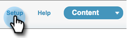
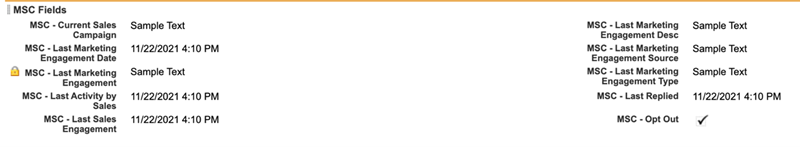
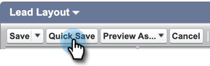

# Avinstallera Marketo Sales Connect från Salesforce Classic {#uninstall-marketo-sales-connect-from-salesforce-classic}

Så här avinstallerar du Marketo Sales Connect-paketet från ditt Salesforce-konto när du har börjat använda Sales Insight Actions.

## Ta bort [!DNL Sales Connect] fält från sidlayout {#remove-sales-connect-fields-from-page-layout}

1. Klicka på [!DNL Salesforce] i **[!UICONTROL Setup]** Classic.

   

1. Expandera (men klicka inte på) [!UICONTROL Build] under [!UICONTROL Customize] i det vänstra navigeringsfältet och sedan [!UICONTROL Leads]. Välj sedan **[!UICONTROL Page Layouts]**.

   

1. Klicka på **[!UICONTROL Edit]** bredvid Leadlayout.

   

1. Välj **[!UICONTROL Fields]** i konsolen. Sök efter MSC i Snabbsökning. Alla nedtonade fält har lagts till i sidlayouten. Du måste ta bort dem.

   

   >[!NOTE]
   >
   >Om inget av fälten är nedtonat betyder det att du inte har lagt till dem i sidlayouten. Du kan hoppa över det här avsnittet.

1. Bläddra till det avsnitt som innehåller dina [!DNL Sales Connect] anpassade fält.

   

1. Det finns 10 typer av MSC-fält som kan läggas till i det här avsnittet. Ta bort alla fält som du har lagt till eller ta bort hela avsnittet.

1. Klicka på **[!UICONTROL Quick Save]** när du är klar.

   

## Ta bort [!DNL Sales Connect]-knappar från sidlayouter {#remove-sales-connect-buttons-from-page-layouts}

1. Välj **[!UICONTROL Buttons]** i konsolen (steg 4 ovan). Sök i &quot;MSC.&quot; Alla nedtonade knappar har lagts till i det anpassade knappavsnittet. Du måste ta bort dem.

   

   >[!NOTE]
   >
   >Om ingen av knapparna är nedtonad betyder det att du inte har lagt till dem. Du kan hoppa över det här avsnittet.

1. Dra och släpp MSC-knapparna från avsnittet [!UICONTROL Custom Buttons] till konsolen.

   

1. Klicka på **[!UICONTROL Quick Save]** när du är klar.

   

## Ta bort [!DNL Sales Connect] fält från avsnittet [!UICONTROL Activity History] {#remove-sales-connect-fields-from-activity-history-section}

1. Bläddra till sidans nedre del till det [!UICONTROL Activity History] relaterade listavsnittet och klicka på ikonen för skiftnyckel.

   

1. Markera [!DNL Sales Connect]-fälten i området [!UICONTROL Selected Fields] och klicka på pilen [!UICONTROL Remove]. Klicka på **[!UICONTROL OK]** när du är klar.

   

   >[!NOTE]
   >
   >Förkortningen MSE _är_ [!DNL Sales Connect]. Det är bara det föregående namnet&quot;Marketo Sales Engage&quot;.

1. Klicka på **Spara** när du är klar med sidan Leads.

## Ta bort [!DNL Sales Connect] gruppåtgärdsknappar från leadlistvyn {#remove-sales-connect-bulk-action-buttons-from-lead-list-view}

1. Expandera (men klicka inte på) [!UICONTROL Build] under [!UICONTROL Customize] i det vänstra navigeringsfältet och sedan [!UICONTROL Leads]. Välj sedan **[!UICONTROL Search Layouts]**.

   

1. Klicka på **[!UICONTROL Edit]** bredvid Leads-listvyn.

   

1. Välj **[!UICONTROL Add to MSC Campaign (Classic)]**, **[!UICONTROL Email with MSC (Classic)]** och **[!UICONTROL Push to MSC (Classic)]** och klicka på pilen [!UICONTROL Remove]. Klicka sedan på **[!UICONTROL Save]**.

   

Du bör inte längre se knapparna i leadlistevyn.

## Ta bort MSC-konfiguration för kontakter {#remove-msc-configuration-for-contacts}

1. Klicka på [!DNL Salesforce] i **[!UICONTROL Setup]**.

1. Expandera (men klicka inte på) [!UICONTROL Build] under [!UICONTROL Customize] i det vänstra navigeringsfältet och sedan [!UICONTROL Contacts]. Välj sedan **[!UICONTROL Page Layouts]**.

1. Klicka på **[!UICONTROL Edit]** bredvid Kontaktlayout.

1. Upprepa steg från alla tre avsnitten.

## Ta bort MSC-konfiguration för affärsmöjlighet {#remove-msc-configuration-for-opportunity}

1. Klicka på [!DNL Salesforce] i **[!UICONTROL Setup]**.

1. Expandera (men klicka inte på) [!UICONTROL Build] under [!UICONTROL Customize] i det vänstra navigeringsfältet och sedan [!UICONTROL Opportunities]. Välj sedan **[!UICONTROL Page Layouts]**.

1. Klicka på **[!UICONTROL Edit]** bredvid säljprojektslayout.

1. Upprepa steg från alla tre avsnitten.

Affärsmöjlighetsvyn har bara en knapp -&quot;Skicka MSE-e-post&quot; och följande fält:

## Ta bort MSC-konfiguration för konto {#remove-msc-configuration-for-account}

1. Klicka på [!DNL Salesforce] i **[!UICONTROL Setup]**.

1. Expandera (men klicka inte på) [!UICONTROL Build] under [!UICONTROL Customize] i det vänstra navigeringsfältet och sedan [!UICONTROL Account]. Välj sedan **[!UICONTROL Page Layouts]**.

1. Klicka på **[!UICONTROL Edit]** bredvid Kontolayout.

1. Upprepa steg från alla tre avsnitten.

Kontovyn har bara en knapp -&quot;Skicka MSE-e-post&quot; och följande fält:

## Ta bort Marketo Sales Outbox {#remove-marketo-sales-outbox}

1. I [!DNL Salesforce] klickar du på fliken **+** högst upp på skärmen.

1. Klicka på **[!UICONTROL Customize My Tabs]**.

1. Välj alternativet Marketo Sales Outbox till höger. Klicka på pilen [!UICONTROL Remove] och sedan på **[!UICONTROL Save]**.

## Ta bort [!DNL Sales Connect]-paket {#delete-sales-connect-package}

När du har tagit bort alla objekt från ditt Salesforce-konto följer du stegen nedan.

1. Klicka på [!DNL Salesforce] i **[!UICONTROL Setup]**.

1. Ange&quot;Apex Classes&quot; i rutan Snabbsökning.

1. Klicka på **Delete** bredvid alla MarketoSalesConnectionCustomization- eller MarketoSalesEngageCustomization-poster i listan.

Du är redo!

Här är en lista över alla objekt som behöver tas bort från din Salesforce-instans:

## Anpassningsinformation för [!DNL Sales Connect] {#sales-connect-customization-details}

<table>
 <tr>
  <th>Anpassade aktivitetsfält</th>
  <th>Beskrivning</th>
  <th>Typ</th>
  <th>Datatyp</th>
 </tr>
 <tr>
  <td>[!UICONTROL MSC Call Local Presence ID]</td>
  <td>Som användare kan jag välja Lokal närvaro som alternativ när jag ringer samtal från MSC Phone. Inkommande samtal visar ett lokalt nummer för mottagaren</td>
  <td>Aktivitet</td>
  <td>Text</td>
 </tr>
 <tr>
  <td>[!UICONTROL MSC Call Recording URL]</td>
  <td>Samtal kan spelas in och en länk för inspelningen loggas här </td>
  <td>Aktivitet</td>
  <td>Text</td>
 </tr>
 <tr>
  <td>[!UICONTROL MSC Campaign]</td>
  <td>Loggnamn för MSC-kampanjen som kontakten/leadet är på</td>
  <td>Aktivitet</td>
  <td>Text</td>
 </tr>
 <tr>
  <td>[!UICONTROL MSC Campaign URL]</td>
  <td>Loggar URL till kampanjen som skapades i MSC. Om du klickar på detta öppnas kampanjen i MSC-webbappen</td>
  <td>Aktivitet</td>
  <td>Text</td>
 </tr>
 <tr>
  <td>[!UICONTROL MSC Campaign Current Step]</td>
  <td>Om en kontakt/lead finns i en kampanj loggas namnet på steget som användaren är på</td>
  <td>Aktivitet</td>
  <td>Kryssruta</td>
 </tr>
 <tr>
  <td>[!UICONTROL MSC Email Attachment Viewed]</td>
  <td>Loggar data när ett e-postmeddelande skickas med en bifogad fil som visas av mottagaren</td>
  <td>Aktivitet</td>
  <td>Kryssruta</td>
 </tr>
 <tr>
  <td>[!UICONTROL MSC Email Clicked]</td>
  <td>Loggar en bock när mottagaren klickar på en länk i e-postmeddelandet</td>
  <td>Aktivitet</td>
  <td>Kryssruta</td>
 </tr>
 <tr>
  <td>[!UICONTROL MSC Email Replied]</td>
  <td>Loggar en bock när mottagaren svarar på e-postmeddelandet</td>
  <td>Aktivitet</td>
  <td>Text</td>
 </tr>
 <tr>
  <td>[!UICONTROL MSC Email Status]</td>
  <td>Visar om ett e-postmeddelande skickas/håller på att skickas/studsas (spårning av studsade e-postmeddelanden beror på vilken leveranskanal som används)</td>
  <td>Aktivitet</td>
  <td>Text</td>
 </tr>
 <tr>
  <td>[!UICONTROL MSC Email Template]</td>
  <td>Loggnamn för MSC-mallen som användes i e-postmeddelandet som skickades till leadet/kontakten</td>
  <td>Aktivitet</td>
  <td>Text</td>
 </tr>
 <tr>
  <td>[!UICONTROL MSC Email Template URL]</td>
  <td>Loggar URL till mallen som skapades i MSC. Om du klickar på det här öppnas mallen i MSC-webbprogrammet</td>
  <td>Aktivitet</td>
  <td>Text</td>
 </tr>
 <tr>
  <td>[!UICONTROL MSC Email URL]</td>
  <td>Om du klickar på den här URL:en öppnas kommandocentralen i MSC och historikfliken med personinformationsvyn öppnas där användaren kan se det skickade e-postmeddelandet</td>
  <td>Aktivitet</td>
  <td>Text</td>
 </tr>
 <tr>
  <td>[!UICONTROL MSC Email Viewed]</td>
  <td>Loggar en bock när mottagaren visar ett e-postmeddelande</td>
  <td>Aktivitet</td>
  <td>Kryssruta</td>
 </tr>
</table>

<table>
 <tr>
  <th>MSC-sammanslagningsloggningsfält</th>
  <th>Beskrivning</th>
  <th>Typ</th>
  <th>Datatyp</th>
 </tr>
 <tr>
  <td>MSC - Senaste marknadsföringsåtagande</td>
  <td>Senaste inkommande engagemang från marknadsföring</td>
  <td>
  
Konto
  
Kontakt
  
Lead
  
Möjligheter</td>
  <td>Data och tid</td>
 </tr>
 <tr>
  <td>MSC - datum för senaste marknadsföringsåtagande</td>
  <td>Tidstämpel för engagemang från marknadsföring</td>
  <td>
  
Konto
  
Kontakt
  
Lead
  
Möjligheter</td>
  <td>Data och tid</td>
 </tr>
 <tr>
  <td>MSC - Senaste marknadsföringsbesök</td>
  <td>Beskrivning av ärendet</td>
  <td>
  
Konto
  
Kontakt
  
Lead
  
Möjligheter</td>
  <td>Text</td>
 </tr>
 <tr>
  <td>MSC - senaste marknadsföringsengagemanget Source</td>
  <td>Source för marknadsföringsinsatser</td>
  <td>
  
Konto
  
Kontakt
  
Lead
  
Möjligheter</td>
  <td>Text</td>
 </tr>
 <tr>
  <td>MSC - Typ av senaste marknadsföringsåtagande</td>
  <td>Typ av engagemang (t.ex. webbaktivitet)</td>
  <td>
  
Konto
  
Kontakt
  
Lead
  
Möjligheter</td>
  <td>Text</td>
 </tr>
 <tr>
  <td>MSC - senaste aktivitet per försäljning</td>
  <td>Senaste utgående aktivitet som utfördes av säljteamet</td>
  <td>
  
Konto
  
Kontakt
  
Lead
  
Möjligheter</td>
  <td>Data och tid</td>
 </tr>
 <tr>
  <td>MSC - senaste svar</td>
  <td>Senaste e-postsvar till försäljning via e-post</td>
  <td>
  
Konto
  
Kontakt
  
Lead
  
Möjligheter</td>
  <td>Data och tid</td>
 </tr>
 <tr>
  <td>MSC - aktuell försäljningskampanj</td>
  <td>Loggnamn för MSC-kampanjen som kontakten/leadet är på</td>
  <td>
  
Konto
  
Kontakt
  
Lead
  
Möjligheter</td>
  <td>Text</td>
 </tr>
 <tr>
  <td>MSC - senaste försäljningsåtagande</td>
  <td>Senaste inkommande ärende från försäljning</td>
  <td>
  
Konto
  
Kontakt
  
Lead
  
Möjligheter</td>
  <td>Data och tid</td>
 </tr>
 <tr>
  <td>MSC - avanmäl dig</td>
  <td>Avanmäl dig</td>
  <td>
  
Konto
  
Kontakt
  
Lead
  
Möjligheter</td>
  <td>Kryssruta</td>
 </tr>
</table>

<table>
 <tr>
  <th>MSC-knappar</th>
  <th>Beskrivning</th>
  <th>Typ</th>
 </tr>
 <tr>
  <td>[!UICONTROL Send MSC Email]</td>
  <td>Skicka e-post från [!DNL Salesforce]</td>
  <td>
  
Konto
  
Kontakt
  
Lead
  
Möjligheter</td>
 </tr>
 <tr>
  <td>[!UICONTROL Add to MSC Campaign]</td>
  <td>Lägg till i MSC-kampanjer från [!DNL Salesforce]</td>
  <td>
  
Kontakt
  
Lead</td>
 </tr>
 <tr>
  <td>[!UICONTROL Push to MSC]</td>
  <td>Skicka kontakt från [!DNL Salesforce] till MSC</td>
  <td>
  
Kontakt
  
Lead</td>
 </tr>
 <tr>
  <td>[!UICONTROL Call with MSC]</td>
  <td>Ring säljsamtal från [!DNL Salesforce]</td>
  <td>
  
Kontakt
  
Lead</td>
 </tr>
</table>

<table>
 <tr>
  <th>MSC-gruppåtgärdsknappar</th>
  <th>Beskrivning</th>
  <th>Typ</th>
 </tr>
 <tr>
  <td>[!UICONTROL Add to MSC Campaign (Classic)]</td>
  <td>Lägg till i MSC-kampanjer från [!DNL Salesforce]</td>
  <td>
  
Kontakt
  
Lead</td>
 </tr>
 <tr>
  <td>[!UICONTROL Push to MSC (Classic)]</td>
  <td>Skicka kontakt från [!DNL Salesforce] till MSC</td>
  <td>
  
Kontakt
  
Lead</td>
 </tr>
 <tr>
  <td>[!UICONTROL Email with MSC (Classic)]</td>
  <td>E-post med MSC från [!DNL Salesforce]</td>
  <td>
  
Kontakt
  
Lead</td>
 </tr>
</table>
