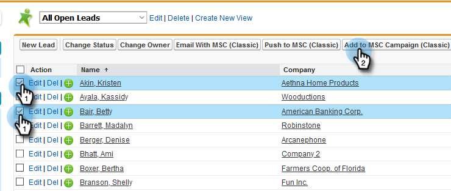

# Använda gruppåtgärder i Salesforce Classic {#using-bulk-actions-in-salesforce-classic}

Lär dig hur du utför satsvisa åtgärder, som att lägga till leads till en kampanj, skicka ett e-postmeddelande eller skicka leads från Salesforce till Sales Connect.

>[!PREREQUISITES]
>
>Uppdatera till den senaste versionen av paketet Sales Connect och installera gruppåtgärdsknapparna i din lead-/kontaktvy. [Klicka här för instruktioner](http://s3.amazonaws.com/tout-user-store/salesforce/assets/Marketo+Sales+Engage+For+Salesforce_+Installation+and+Success+Guide.pdf).

>[!NOTE]
>
>Innan du följer de angivna stegen måste du kontrollera att du är inloggad på ditt Marketo Sales Connect-konto.

## Massutskick {#bulk-email}

1. Klicka på fliken **Leads** i Salesforce och sedan på knappen **Gå**.

   

1. Välj önskade leads och klicka på knappen **E-post med MSC (Classic)**.

   

1. Ett MSC-e-postmeddelande visas. Den innehåller följande funktioner:

   a. Fältet &quot;Till&quot; visar &quot;Alla kvitton&quot; - motsvarar listan med leads som du har valt i Leadlistvyn\
   b. Den här listan visas i den vänstra panelen, med namnet&quot;Massdisposition&quot; - du kan lägga till/ta bort mottagare här\
   c. Du kan välja en mall eller skapa ett eget e-postmeddelande\
   d. Du kan förhandsgranska dynamiska fält som ska fyllas i i e-postmeddelandet\
   e. Du kan skicka e-postmeddelandet direkt eller schemalägga att skicka det vid ett senare tillfälle

   

## Lägg till i kampanj {#add-to-campaign}

1. Klicka på fliken **Leads** i Salesforce och sedan på knappen **Gå**.

   

1. Välj önskade leads och klicka på knappen **Lägg till i MSC Campaign (Classic)**.

   

1. Popup-fönstret Lägg till personer i din kampanj visas. Klicka på **Nästa** och gå igenom det typiska kampanjflödet för att utlösa en MSC-kampanj.

   

## Push to Marketo Sales Connect {#push-to-marketo-sales-connect}

1. Klicka på fliken **Leads** i Salesforce och sedan på knappen **Gå**.

   

1. Välj önskade leads och klicka på knappen **Skicka till MSC (Classic)**.

   

1. En ny flik med namnet&quot;Salesforce Bridge&quot; öppnas. Klicka på knappen **Gå till grupp →**.

   

1. Du kommer att skickas till ditt MSC-konto där du kan se en grupp som har skapats med datum-/tidsstämpel. Du får ett meddelande när synkroniseringen är klar och gruppen kommer att inkludera leads som synkroniseras från Salesforce.

   

>[!NOTE]
>
>Du kan även använda gruppåtgärder i kontaktlistvyn genom att följa samma steg.

>[!NOTE]
>
>**Relaterade artiklar**
>
>* [Skicka e-post via gruppe-post](http://docs.marketo.com/x/KAQ6Ag)
>* [Disponera massutskick med Markera och skicka](http://docs.marketo.com/display/public/DOCS/Composing+Bulk+Emails+with+Select+and+Send#ComposingBulkEmailswithSelectandSend-SendingEmails)

>

