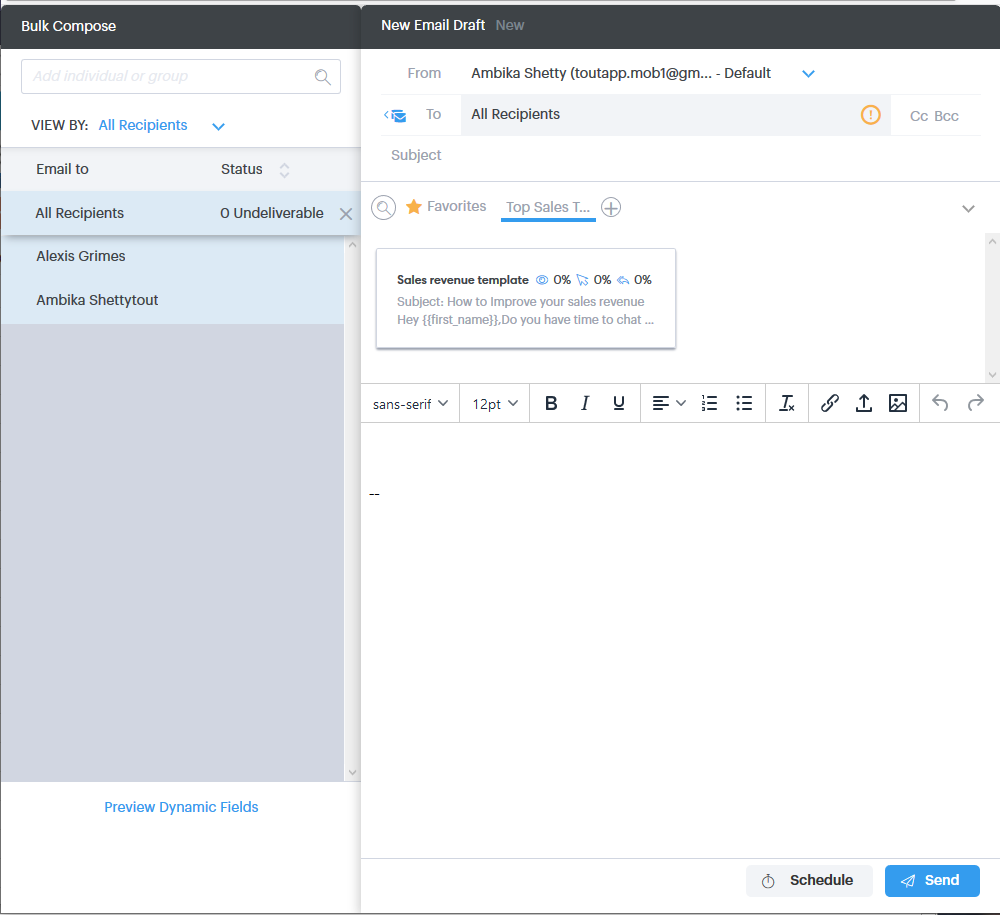

# Använda gruppåtgärder i Salesforce Lightning {#using-bulk-actions-in-salesforce-lightning}

Lär dig hur du utför satsvisa åtgärder, som att lägga till leads till en kampanj, skicka ett e-postmeddelande eller skicka leads från Salesforce till Sales Connect.

>[!PREREQUISITES]
>
>Uppdatera till den senaste versionen av paketet Sales Connect och installera gruppåtgärdsknapparna i din lead-/kontaktvy. [Klicka här för instruktioner](https://s3.amazonaws.com/tout-user-store/salesforce/assets/SF+Guide+for+Lightning.pdf).

>[!NOTE]
>
>Innan du följer stegen nedan kontrollerar du att du är inloggad på ditt Marketo Sales Connect-konto.

## Massutskick {#bulk-email}

1. I Salesforce klickar du på **Leads** väljer du sedan en lista med önskade leads.

   

   >[!NOTE]
   >
   >Om du redan är med i listan måste du köra den igen genom att välja den i listrutan för att se till att MSC-gruppåtgärdsknapparna visas. Det här är Salesforce-beteende som inte kan ändras.

1. Klicka på listrutan med pilar (längst till höger på skärmen) och välj **E-post med MSC**.

   

1. Ett MSC-e-postmeddelande visas. Den innehåller följande funktioner:

   a. Fältet &quot;Till&quot; visar &quot;Alla kvitton&quot; - motsvarar listan med leads som du har valt i Leadlistvyn\
   b. Den här listan visas i den vänstra panelen, med namnet&quot;Massdisposition&quot; - du kan lägga till/ta bort mottagare här\
   c. Du kan välja en mall eller skapa ett eget e-postmeddelande\
   d. Du kan skicka e-postmeddelandet direkt eller schemalägga att skicka det vid ett senare tillfälle

   

## Lägg till i kampanj {#add-to-campaign}

1. I Salesforce klickar du på **Leads** väljer du sedan en lista med önskade leads.

   

1. Klicka på listrutan med pilar (längst till höger på skärmen) och välj **Lägg till i MSC Campaign**.

   

1. Popup-fönstret Lägg till personer i din kampanj visas. Klicka **Nästa** och gå igenom det typiska kampanjflödet för att utlösa en MSC-kampanj.

   

## Skicka till Marketo Sales Connect {#push-to-marketo-sales-connect}

1. I Salesforce klickar du på **Leads** väljer du sedan en lista med önskade leads.

   

1. Klicka på listrutan med pilar (längst till höger på skärmen) och välj **Skicka till MSC**.

   

1. En ny flik med namnet&quot;Salesforce Bridge&quot; öppnas. Klicka på **Gå till grupp →** -knappen.

   

1. Du kommer att skickas till ditt MSC-konto där du kan se en grupp som har skapats med datum-/tidsstämpel. Du får ett meddelande när synkroniseringen är klar och gruppen kommer att inkludera leads som synkroniseras från Salesforce.

   

>[!NOTE]
>
>Du kan även använda gruppåtgärder i kontaktlistvyn genom att följa samma steg.

>[!MORELIKETHIS]
>
>* [Skicka e-post via gruppe-post](/help/marketo/product-docs/marketo-sales-connect/email/using-the-compose-window/sending-emails-via-group-email.md)
>* [Disponera massutskick med Markera och skicka](/help/marketo/product-docs/marketo-sales-connect/email/using-the-compose-window/composing-bulk-emails-with-select-and-send.md#sending-emails)
