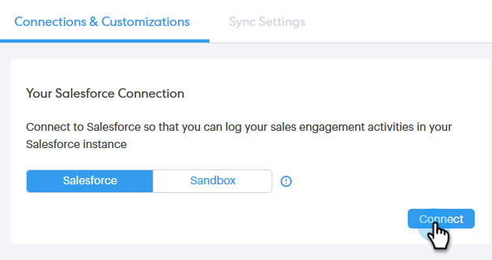

# Anslut ditt Sales Connect-konto till Salesforce {#connect-your-sales-connect-account-to-salesforce}

Följ de här enkla stegen för att ansluta Sales Connect till Salesforce.

## Ansluta som administratör {#how-to-connect-as-an-admin}

1. I Sales Connect klickar du på kugghjulsikonen i det övre högra hörnet och väljer **Settings**.

   

1. Klicka på **Salesforce** under Administratörsinställningar.

   

1. Klicka på **Anslut** på fliken Anslutningar och anpassningar.

   

1. Klicka på **OK**.

   

1. Om du redan är inloggad i Salesforce är du ansluten. Om du inte gör det blir du ombedd att logga in.

## Ansluta som icke-administratör {#how-to-connect-as-a-non-admin}

1. Klicka på kugghjulsikonen i Sales Connect och välj **Settings**.

   

1. Välj **Salesforce** under Mitt konto.

   

1. Klicka på **Anslut** på fliken Anslutningar och anpassningar.

   

1. Klicka på **OK**.

   

1. Om du redan är inloggad i Salesforce är du ansluten. Om du inte gör det blir du ombedd att logga in.

