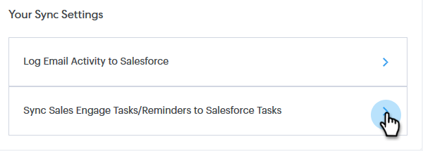

# Salesforce Sync Settings {#salesforce-sync-settings}

## Logga e-postaktivitet till Salesforce via API {#logging-email-activity-to-salesforce-via-api}

Den här funktionen kräver att du finns i Enterprise/Unlimited Edition av Salesforce eller Professional Edition om du har köpt Integration via Web Services API.

>[!PREREQUISITES]
>
>Salesforce och Sales Connect måste vara anslutna.

1. I [!DNL Sales Connect] klickar du på kugghjulsikonen i det övre högra hörnet och väljer **[!UICONTROL Settings]**.

   

1. Under [!UICONTROL My Account] ([!UICONTROL Admin Settings] om du är administratör) klickar du på **[!UICONTROL Salesforce]**.

   

1. Klicka på fliken **[!UICONTROL Sync Settings]**.

   

1. Klicka på pilen bredvid Logga e-postaktivitet till [!DNL Salesforce].

   

1. Klicka på fliken **[!UICONTROL Salesforce API]**. På det här kortet kan du ange din inställning för loggningsinformation till [!DNL Salesforce]. Klicka på **[!UICONTROL Save]** när du är klar.

   

## Logga e-postaktivitet till Salesforce via e-post till Salesforce (BCC) {#logging-email-activity-to-salesforce-via-email-to-salesforce-bcc}

När du har aktiverat&quot;E-post till Salesforce (BCC)&quot; får du en kopia av dina säljmeddelanden och dina e-postmeddelanden loggas som aktiviteter på affärsmöjligheter, leads och kontakter.

>[!PREREQUISITES]
>
>[!DNL Salesforce] och [!DNL Sales Connect] måste vara anslutna.

**Logga dina e-postmeddelanden i Salesforce via e-post (BCC)**

1. I [!UICONTROL Sales Connect] klickar du på kugghjulsikonen i det övre högra hörnet och väljer **[!UICONTROL Settings]**.

   

1. Under [!UICONTROL My Account] ([!UICONTROL Admin Settings] om du är administratör) klickar du på **[!UICONTROL Salesforce]**.

   

1. Klicka på fliken **[!UICONTROL Sync Settings]**.

   

1. Klicka på fliken **[!UICONTROL Email to Salesforce (BCC)]** och klicka på **[!UICONTROL Activate]**.

   

Om din e-postadress till [!DNL Salesforce] av någon anledning inte kommer in följer du de här stegen för att aktivera funktionen Hemlig kopia i ditt [!DNL Salesforce]-konto:

1. Logga in på din [!DNL Salesforce]-instans.
1. Hitta ditt användarnamn i det övre högra hörnet och välj listrutan.
1. Välj **[!UICONTROL My Settings]**.
1. Välj **[!UICONTROL Email]**.
1. Välj **[!UICONTROL My Email to Salesforce]**.
1. På den här sidan visas ett fält med namnet&quot;E-post till Salesforce-adress&quot;. Om inget fylls i bredvid det bläddrar du nedåt till&quot;Mina godkända e-postadresser&quot;.
1. Ange den eller de e-postadresser som du vill ska kopieras.
1. Klicka på **[!UICONTROL Save Changes]**.

**Det går inte att hitta min e-postadress till [!DNL Salesforce] i Mina inställningar**

Om du inte ser Min e-post till Salesforce under dina inställningar har administratören kanske inte aktiverat den. Detta kan inträffa om ditt team inte har använt [!DNL Salesforce] tidigare eller om ditt team aldrig har använt den hemkontrolladress som [!DNL Salesforce] tillhandahåller.

>[!NOTE]
>
>Du måste ha administratörsbehörighet för att kunna konfigurera detta.

1. Klicka på **[!UICONTROL Setup]**.
1. Klicka på **[!UICONTROL Email Administration]**.
1. Klicka på **[!UICONTROL Email to Salesforce]**.
1. Klicka på **[!UICONTROL Edit]**.
1. Markera rutan bredvid [!UICONTROL Active].
1. Klicka på **[!UICONTROL Save]**.

## Synkronisera aktiviteter/påminnelser för anslutning av försäljning till [!DNL Salesforce] aktiviteter {#sync-sales-connect-tasks-reminders-to-salesforce-tasks}

1. Klicka på kugghjulsikonen uppe till höger och välj **[!UICONTROL Settings]**.

   

1. Under [!UICONTROL My Account] ([!UICONTROL Admin Settings] om du är administratör) klickar du på **[!UICONTROL Salesforce]**.

   

1. Klicka på fliken **[!UICONTROL Sync Settings]**.

   

1. Klicka på pilen bredvid [!UICONTROL Sync Sales Engage Tasks/Reminders to Salesforce Tasks].

   

1. Välj önskat alternativ (&quot;[!UICONTROL Do not sync to Salesforce tasks]&quot; är valt som standard).

   
