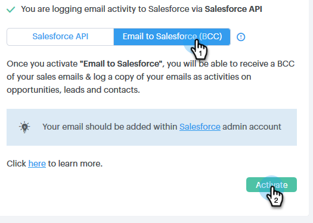

# Inställningar för Salesforce-synkronisering {#salesforce-sync-settings}

## Logga e-postaktivitet till Salesforce via API {#logging-email-activity-to-salesforce-via-api}

Den här funktionen kräver att du finns i Enterprise/Unlimited Edition av Salesforce eller Professional Edition om du har köpt Integration via Web Services API.

>[!PREREQUISITES]
>
>Salesforce och Sales Engage måste vara anslutna.

1. I Sales Engage klickar du på kugghjulsikonen i det övre högra hörnet och väljer **Inställningar**.

   

1. Under Mitt konto (Administratörsinställningar om du är administratör) klickar du på **Salesforce**.

   

1. Klicka på fliken **Synkronisera inställningar**.

   

1. Klicka på pilen bredvid Logga e-postaktivitet till Salesforce.

   

1. Klicka på fliken **Salesforce API**. På det här kortet kan du ange din inställning för att logga information till Salesforce. Klicka på **Spara** när du är klar.

   

## Loggning av e-postaktivitet till Salesforce via e-post till Salesforce (BCC) {#logging-email-activity-to-salesforce-via-email-to-salesforce-bcc}

När du har aktiverat&quot;E-post till Salesforce (BCC)&quot; får du en kopia av dina säljmeddelanden och dina e-postmeddelanden loggas som aktiviteter på affärsmöjligheter, leads och kontakter.

>[!PREREQUISITES]
>
>Salesforce och Sales Engage måste vara anslutna.

**Logga dina e-postmeddelanden i Salesforce via e-post (BCC)**

1. I Sales Engage klickar du på kugghjulsikonen i det övre högra hörnet och väljer **Inställningar**.

   

1. Under Mitt konto (Administratörsinställningar om du är administratör) klickar du på **Salesforce**.

   

1. Klicka på fliken **Synkronisera inställningar**.

   

1. Klicka på fliken **E-post till Salesforce (BCC)** och klicka på **Aktivera**.

   

Om din e-postadress till Salesforce inte kommer in av någon anledning, följer du de här stegen för att aktivera funktionen Kontroll av webbläsarkompatibilitet i ditt Salesforce-konto:

1. Logga in på din Salesforce-instans.
1. Hitta ditt användarnamn i det övre högra hörnet och välj listrutan.
1. Välj **Mina inställningar**.
1. Välj **E-post**.
1. Välj **Min e-post till Salesforce**.
1. På den här sidan visas ett fält med namnet&quot;E-post till Salesforce-adress&quot;. Om inget fylls i bredvid det bläddrar du nedåt till&quot;Mina godkända e-postadresser&quot;.
1. Ange den eller de e-postadresser som du vill ska kopieras.
1. Klicka på **Spara ändringar**.

**Det går inte att hitta min e-post till Salesforce i Mina inställningar**

Om du inte ser Min e-post till Salesforce under dina inställningar har administratören kanske inte aktiverat den. Det här kan hända om ditt team inte har använt Salesforce tidigare, eller om ditt team aldrig har använt den BCC-adress som Salesforce erbjuder.

>[!NOTE]
>
>Du måste ha administratörsbehörighet för att kunna konfigurera detta.

1. Klicka på **Inställningar *.* **
1. Klicka på **E-postadministration *.* **
1. Klicka på **E-post till Salesforce *.* **
1. Klicka på **Redigera**.
1. Markera rutan bredvid&quot;Aktiv*&quot;.*
1. Klicka på **Spara *.* **

## Synkronisera aktiviteter/påminnelser för försäljningsengagemang till Salesforce-aktiviteter {#sync-sales-engage-tasks-reminders-to-salesforce-tasks}

1. Klicka på kugghjulsikonen i det övre högra hörnet och välj **Inställningar**.

   

1. Under Mitt konto (Administratörsinställningar om du är administratör) klickar du på **Salesforce**.

   

1. Klicka på fliken **Synkronisera inställningar**.

   

1. Klicka på pilen bredvid Synkronisera försäljningsengagemangsuppgifter/påminnelser till Salesforce-uppgifter.

   

1. Välj önskat alternativ (&quot;Synkronisera inte till Salesforce-uppgifter&quot; är valt som standard).

   

