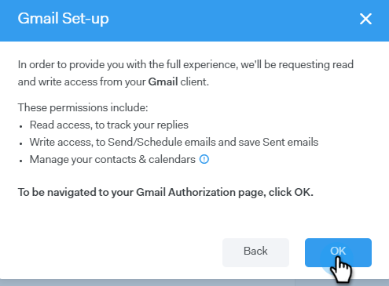

# Email Connection för Gmail-användare {#email-connection-for-gmail-users}

Att ansluta till Gmail innebär att du får svarsspårning, tillgång till Gmail-leveranskanalen, möjlighet att schemalägga e-postmeddelanden i Gmail och skicka regelefterlevnad.

>[!CAUTION]
>
>Om du [använder filter](https://support.google.com/mail/answer/6579?hl=en#zippy=%2Ccreate-a-filter%2Cedit-or-delete-filters){target="_blank"} eller regler i ditt Gmail-konto för att automatiskt markera e-postmeddelanden som lästa, kan detta orsaka problem med svarsuppföljning. Vi rekommenderar att du inaktiverar alla regler som automatiskt markerar e-postmeddelanden som lästa när du använder svarsspårning med Gmail.

1. Klicka på kugghjulsikonen i [!DNL Sales Connect] och välj **[!UICONTROL Settings]**.

   

1. Välj **[!UICONTROL Email Settings]** under Mitt konto.

   

1. Klicka på fliken **[!UICONTROL Email Connection]**.

   

1. Klicka på **[!UICONTROL Get Started]**.

   

1. Markera **[!UICONTROL I use Gmail to send emails]** och klicka på **[!UICONTROL Next]**.

   

1. Klicka på **[!UICONTROL OK]**.

   

1. Om du redan har loggat in på Gmail väljer du det konto du vill ansluta till. Om inte anger du din Gmail-adress och klickar på **[!UICONTROL Next]**. I det här exemplet är vi ännu inte inloggade.

   

1. Ange ditt lösenord och klicka på **[!UICONTROL Next]**.

   

1. Klicka på **[!UICONTROL Allow]**.

   

   Du kan använda den här anslutningen för att spåra e-postmeddelanden och även som en leveranskanal.

>[!NOTE]
>
>Gmail tillämpar sina egna sändningsbegränsningar. [Läs mer här](/help/marketo/product-docs/marketo-sales-connect/email/email-delivery/email-connection-throttling.md#email-provider-limits).
