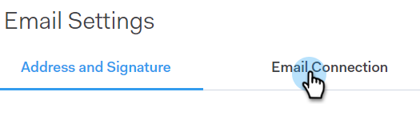
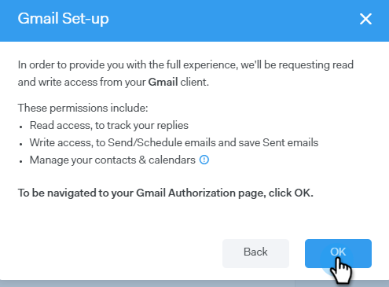

# Fliken E-postanslutning för Gmail-användare {#email-connection-tab-for-gmail-users}

Att ansluta till Gmail innebär att du får svarsspårning, tillgång till Gmail-leveranskanalen, möjlighet att schemalägga e-postmeddelanden i Gmail och skicka regelefterlevnad.

1. Klicka på kugghjulsikonen i Sales Connect och välj **Settings**.

   

1. Välj **E-postinställningar** under Mitt konto.

   

1. Klicka på fliken **E-postanslutning** .

   

1. Klicka på **Kom igång**.

   

1. Välj **Jag använder Gmail för att skicka e-post** och klicka på **Nästa**.

   

1. Klicka på **OK**.

   

1. Om du redan har loggat in på Gmail väljer du det konto du vill ansluta till. Om inte anger du din Gmail-adress och klickar på **Nästa**. I det här exemplet är vi ännu inte inloggade.

   

1. Ange ditt lösenord och klicka på **Nästa**.

   

1. Klicka på **Tillåt**.

   

   Du kan använda den här anslutningen för att spåra e-postmeddelanden och även [som en leveranskanal](http://docs.marketo.com/display/public/DOCS/Setting+up+Your+Delivery+Channel#SettingupYourDeliveryChannel-Gmail).

