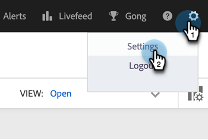

# Installera e-postplugin-programmet Sales Connect för Gmail {#install-the-sales-connect-email-plugin-for-gmail}

Lär dig installera Gmail-plugin-programmet.

>[!IMPORTANT]
>
>E-postplugin-programmen för Gmail och Outlook stöds endast för Marketo Sales Connect-användare. De stöds **inte** för användare av Sales Insight Actions.

1. Klicka på kugghjulsikonen i [webbprogrammet](https://toutapp.com/next#settings) och klicka på **[!UICONTROL Settings]**.

   

1. Klicka på **[!UICONTROL Email Settings]** under Mitt konto.

   

1. Klicka på fliken **[!UICONTROL Plugins]**.

   

1. Klicka på **[!UICONTROL Install]** under Gmail och Google Apps.

   
