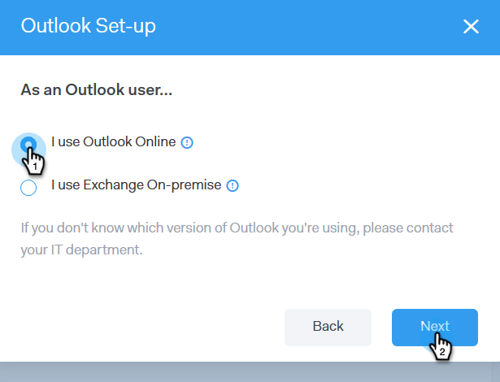

# E-postanslutning för [!DNL Outlook] användare {#email-connection-for-outlook-users}

Lär dig ansluta ditt [!DNL Sales Connect]-konto till [!DNL Outlook].

>[!NOTE]
>
>Varje användare måste ansluta till [!DNL Outlook] från sitt [!DNL Sales Connect]-konto.

## Ansluter till [!DNL Outlook] Online {#connecting-to-outlook-online}

Om du ansluter till [!DNL Outlook] får du svarsspårning, åtkomst till [!DNL Outlook]-leveranskanalen, möjlighet att schemalägga e-postmeddelanden i [!DNL Outlook] och skicka regelefterlevnad.

1. Klicka på kugghjulsikonen i [!DNL Sales Connect] och välj **[!UICONTROL Settings]**.

   

1. Välj **[!UICONTROL Email Settings]** under Mitt konto.

   

1. Klicka på fliken **[!UICONTROL Email Connection]**.

   

1. Klicka på **[!UICONTROL Get Started]**.

   

1. Markera **[!UICONTROL I use Outlook to send emails]** och klicka på **[!UICONTROL Next]**.

   

1. Markera den version av [!DNL Outlook] som du använder och klicka på **[!UICONTROL Next]**. I detta exempel väljer vi [!DNL Outlook Online].

   

   <table> 
    <tbody>
     <tr>
      <td><strong>[!DNL Outlook Online]</strong></td> 
      <td>Även känd som [!DNL Exchange Online]</td> 
     </tr>
     <tr>
      <td><strong>[!DNL Exchange On-premise]</strong></td> 
      <td>Inkluderar [!DNL Exchange] 2013 och 2016</td> 
     </tr>
    </tbody>
   </table>

   >[!NOTE]
   >
   >Marketo stöder för närvarande inte [!DNL Exchange Hybrid]-konton.

1. Klicka på **[!UICONTROL OK]**.

   

1. Om du inte är inloggad på [!DNL Outlook] anger du din inloggningsinformation och klickar på **[!UICONTROL Next]**. Om du är det väljer du det konto du vill ansluta till och klickar på **[!UICONTROL Next]**. I det här exemplet är vi redan inloggade.

   

1. Klicka på **[!UICONTROL Accept]**.

   

   Du kan använda den här anslutningen för att spåra e-postmeddelanden och även som en leveranskanal.

   >[!NOTE]
   >
   >[!DNL Outlook Online (Office365)] tillämpar sina egna sändningsgränser. [Läs mer här](/help/marketo/product-docs/marketo-sales-connect/email/email-delivery/email-connection-throttling.md#email-provider-limits).

## Ansluter till [!DNL Exchange On-Premise] {#connecting-to-exchange-on-premise}

Om du ansluter till [!DNL Exchange On-Premise] får du svarsspårning, åtkomst till [!DNL Outlook]-leveranskanalen, möjlighet att schemalägga e-postmeddelanden i [!DNL Outlook] och skicka regelefterlevnad.

1. Klicka på kugghjulsikonen i [!DNL Sales Connect] och välj **[!UICONTROL Settings]**.

   

1. Välj [!UICONTROL My Account] under **[!UICONTROL Email Settings]**.

   

1. Klicka på fliken **[!UICONTROL Email Connection]**.

   

1. Klicka på **[!UICONTROL Get Started]**.

   

1. Markera **[!UICONTROL I use Outlook to send emails]** och klicka på **[!UICONTROL Next]**.

   

1. Markera den version av [!DNL Outlook] som du använder och klicka på **[!UICONTROL Next]**. I detta exempel väljer vi [!DNL Exchange On-premise].

   

   <table> 
    <tbody>
     <tr>
      <td><strong>[!DNL Outlook Online]</strong></td> 
      <td>Även känd som [!DNL Exchange Online]</td> 
     </tr>
     <tr>
      <td><strong>[!DNL Exchange On-premise]</strong></td> 
      <td>Inkluderar [!DNL Exchange] 2013 och 2016</td> 
     </tr>
    </tbody>
   </table>

1. Ange dina autentiseringsuppgifter och klicka på **[!UICONTROL Connect]**.

   

   >[!NOTE]
   >
   >Om du inaktiverar automatisk upptäckt i listrutan [!DNL Exchange] version måste du fråga din IT-avdelning om URL:en för [!DNL Exchange].

   Du kan använda den här anslutningen för att spåra e-postmeddelanden och även som en leveranskanal.

   >[!NOTE]
   >
   >När du använder [!DNL Exchange On-prem] kommer ditt IT-team att fastställa din sändningsgräns för e-post.
