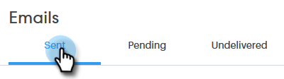
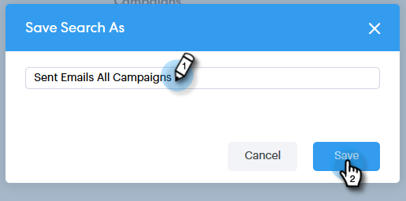

# Översikt över avancerad sökning {#advanced-search-overview}

Genom att använda den avancerade sökningen för att rikta dig till potentiella kunder som har visat, klickat eller svarat på e-postmeddelanden kan du skapa en målinriktad lista över de mest engagerade potentiella kunderna.

## Använda avancerad sökning {#how-to-access-advanced-search}

1. Klicka på **Kommando Center**.

   

1. Klicka på **E-post**.

   

1. Välj lämplig flik.

   

1. Klicka på **Avancerad sökning**.

   

## Filter {#filters}

**Datum**

Välj datumintervall för sökningen. Förinställda datum uppdateras beroende på vilken e-poststatus du väljer (Skickat, Olevererat, Väntande).

**Vem**

Filtrera efter e-postmottagare/avsändare i avsnittet Vem.

| **Visa som** | Filtrera efter en specifik avsändare i din Sales Connect-instans (det här alternativet är endast tillgängligt för administratörer). |
|---|---|
| **Per grupp** | Filtrera e-postmeddelanden efter en viss grupp mottagare. |
| **Per person** | Filtrera efter en viss mottagare. |

**När**

Välj efter skapat datum, leveransdatum, misslyckat datum eller schemalagt datum. Vilka alternativ som är tillgängliga varierar beroende på vilken e-poststatus du väljer (Skickat, Olevererat, Väntande).

**Kampanjer**

Filtrera e-postmeddelanden efter kampanjdeltagande.

**Status**

Det finns tre e-poststatusar att välja mellan. Typen/aktivitetsalternativen ändras baserat på vald status.

***Status: Skickat***

Filtrerar efter din skickade e-postaktivitet. Du kan välja vyer/inga vyer, klicka/klicka utan klick och/eller svar/inga svar.

***Status: Väntande***

Filtrerar efter alla väntande e-postmeddelanden.

| **Schemalagd** | E-postmeddelanden som har schemalagts från dispositionsfönstret (Salesforce eller Web App), e-postplugin-program eller en kampanj. |
|---|---|
| **Utkast** | E-postmeddelanden som är i utkastläge. E-postmeddelanden kräver en ämnesrad och en mottagare för att kunna sparas som ett utkast. |
| **Pågår** | E-postmeddelanden som håller på att skickas. E-postmeddelanden får inte vara kvar i det här läget i mer än några sekunder. |

***Status: Olevererad***

Filtrerar efter e-postmeddelanden som aldrig levererats.

| **Misslyckades** | När ett e-postmeddelande inte kan skickas från Sales Connect (vanliga orsaker är: e-postmeddelanden skickas till kontakter som inte längre är prenumererade/blockerade eller om det uppstod ett problem med att fylla i de dynamiska fälten). |
|---|---|
| **Studsade** | Ett e-postmeddelande markeras som studsat när det avvisas av mottagarens server. Endast e-postmeddelanden som skickades via Sales Connect-servrar visas här. |
| **Spam** | När e-postmeddelandet har markerats som skräppost (vanlig term för oombedd e-post) av mottagaren. Endast e-postmeddelanden som skickades via Sales Connect-servrar visas här. |

## Sparade sökningar {#saved-searches}

Så här skapar du en sparad sökning.

1. När alla filter är på plats klickar du på **Spara filter som**.

   

1. Ge sökningen ett namn och klicka på **Spara**.

   

   Dina sparade sökningar visas i sidofältet till vänster.

   

