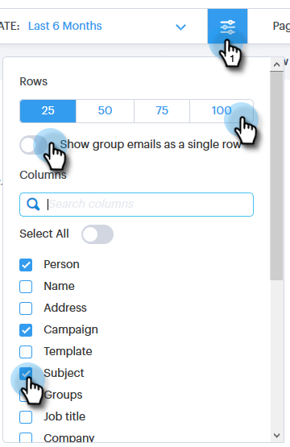

# E-postkolumner och sidlayout för e-post {#email-columns-and-email-page-layout}

Du kan konfigurera alla tillgängliga kolumner så att de visas i e-postavsnittet i kommandocentralen. Konfigurationsinställningarna sparas för varje e-postundermapp (t.ex. Levererad, Misslyckad, Schemalagd osv).

## E-postkolumner {#email-columns}

<table> 
 <colgroup> 
  <col> 
  <col> 
 </colgroup> 
 <tbody> 
  <tr> 
   <th>
Kolumn
</th> 
   <th>Beskrivning</th> 
  </tr> 
  <tr> 
   <td>Person</td> 
   <td>Namn och e-postadress för personen i Sales Connect. Om du klickar på det här fältet öppnas fliken Om i vyn Personinformation.</td> 
  </tr> 
  <tr> 
   <td>Namn</td> 
   <td>Namn på personen i Sales Connect.</td> 
  </tr> 
  <tr> 
   <td>Adress</td> 
   <td>Personens primära e-postadress i Sales Connect.</td> 
  </tr> 
  <tr> 
   <td>Campaign</td> 
   <td>Om e-postmeddelandet skickades som en del av en kampanj visas kampanjens namn. Om du klickar på det här fältet kommer du till inställningssidan för den kampanjen.</td> 
  </tr> 
  <tr> 
   <td>Mall</td> 
   <td>Visar namnet på mallen (om e-postmeddelandet skickades med ett).</td> 
  </tr> 
  <tr> 
   <td colspan="1">Ämne</td> 
   <td colspan="1">E-postmeddelandets ämnesrad.</td> 
  </tr> 
  <tr> 
   <td colspan="1">Grupper</td> 
   <td colspan="1">Visar de grupper som e-postmottagaren tillhör.</td> 
  </tr> 
  <tr> 
   <td>Befattning</td> 
   <td>E-postmottagarens namn.</td> 
  </tr> 
  <tr> 
   <td>Företag</td> 
   <td>E-postmottagarens företag.</td> 
  </tr> 
  <tr> 
   <td>E-poststatus</td> 
   <td>Status som e-postmeddelandet är i. Statusen är: Utkast, schemalagd, Pågår, Skräppost, Begränsad, Misslyckad, Skickat. Skickade e-postmeddelanden visar en aktivitetsström som visar hur många visningar, klickningar och svar som har gjorts i det e-postmeddelandet.</td> 
  </tr> 
  <tr> 
   <td>Skapad den</td> 
   <td>Datum när e-postmeddelandet skapades.</td> 
  </tr> 
  <tr> 
   <td>Senast uppdaterad</td> 
   <td>Datum när e-postmeddelandet senast uppdaterades.</td> 
  </tr> 
  <tr> 
   <td>Leveranskanal</td> 
   <td>Namnet på den leveranskanal som användes för att skicka e-postmeddelandet.</td> 
  </tr> 
  <tr> 
   <td>Senaste aktivitet</td> 
   <td>E-postmottagarens senaste engagemang (t.ex. visa, klicka eller svara).</td> 
  </tr> 
  <tr> 
   <td>Skickat den</td> 
   <td>Det datum då e-postmeddelandet skickades.</td> 
  </tr> 
  <tr> 
   <td>Uppföljningsåtgärder</td> 
   <td>Snabbåtgärdsknappar som kan användas för uppföljning via e-post, telefon, iMail eller uppgift.</td> 
  </tr> 
  <tr> 
   <td>Gruppe-post</td> 
   <td>Visar en bock om e-postmeddelandet skickades som en del av ett gruppe-postmeddelande.</td> 
  </tr> 
  <tr> 
   <td>Aktivitetens förfallodatum</td> 
   <td>Visar förfallodatumet för aktiviteter som är relaterade till e-postmeddelandet. Uppgifter kan relateras till ett e-postmeddelande genom att skapas från snabbåtgärdsknapparna i e-postlistan.</td> 
  </tr> 
  <tr> 
   <td>E-poståtgärd</td> 
   <td>Snabbåtgärdsknappar som kan användas för att utföra åtgärder i e-postmeddelandet. Beroende på status för e-postmeddelandet kan följande åtgärder vara tillgängliga: Arkivera, Slutförd, Ta bort, Försök skicka igen, Avarkivera.</td> 
  </tr> 
  <tr> 
   <td>Typ av aktivitet</td> 
   <td>Visar uppgiftstypen för en aktivitet som är relaterad till e-postmeddelandet. Uppgifter kan relateras till ett e-postmeddelande genom att skapas från snabbåtgärdsknapparna i e-postlistan.</td> 
  </tr> 
  <tr> 
   <td>Misslyckades</td> 
   <td>Visar det datum då e-postmeddelandet misslyckades om e-postmeddelandet inte levererades.</td> 
  </tr> 
 </tbody> 
</table>

## Inställningar för e-postsidlayout {#email-page-layout-settings}

Du kan konfigurera layouten genom att följa dessa steg.

1. Gå till kommandocentralen.

   

1. Markera avsnittet **E-post**.

   

1. Klicka på konfigurationsknappen. Du kan bland annat: välja hur många rader du vill ha, välja vilka fält som ska visas och markera om du vill att gruppmeddelanden ska samlas i ett enda objekt i rutnätet (eller om du vill att alla e-postmeddelanden som är en del av ett e-postrutnät ska visas som ett enda objekt).

   

1. Klicka utanför konfigurationen när du är klar.

