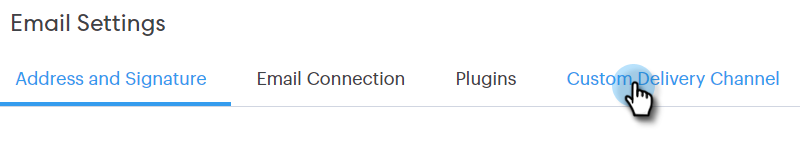

# Konfigurera en anpassad leveranskanal {#setting-up-a-custom-delivery-channel}

Med Marketo Sales Connect kan ni integrera med en anpassad SMTP-server för att leverera e-postmeddelanden. Detta är ett bra alternativ för dem som inte vill skicka massutskick via Gmail eller Exchange.

Användare kan konfigurera en anpassad SMTP-server för egen användning, eller så kan administratörer konfigurera en Team SMTP som ska delas av alla Sales Connect-användare i din instans.

>[!NOTE]
>
>* Förutom att konfigurera SMTP-servern måste din [e-postidentitet verifieras](/help/marketo/product-docs/marketo-sales-connect/getting-started/email-settings/verify-your-email.md) innan du kan skicka e-post.
>* Vi rekommenderar att du samarbetar med IT-teamet eller SMTP-serverleverantören för att få rätt serverautentiseringsuppgifter för din SMTP-server.
>* Du kan inte ansluta Gmail- och Exchange-servern med autentiseringsuppgifterna för SMTP-servern. Använd vår e-postanslutningstjänst för att integrera med dessa leverantörer.

## Anpassad SMTP {#custom-smtp}

1. Logga in på [webbprogrammet](https://toutapp.com/login), klicka på kugghjulsikonen i det övre högra hörnet och välj **Inställningar**.

   

1. Klicka på **E-postinställningar** under Mitt konto.

   

1. Klicka på **Anpassad leveranskanal**.

   

1. Ange autentiseringsuppgifterna för SMTP-servern och klicka på **Anslut**.

   

   >[!NOTE]
   >
   >Om det här är din enda leveranskanal tilldelas den automatiskt till alla dina e-postidentiteter, och du gör det här. Om detta inte är den enda leveranskanalen, fortsätt till steg 5.

1. Klicka på **Adress och signatur** medan du fortfarande är i e-postinställningarna.

   

1. Leta reda på e-postadressen som du vill välja en leveranskanal för och klicka på **Välj leveranskanal**.

   

1. Klicka på **Redigera** i leveranskortet.

   

1. Klicka på listrutan Kanal och välj den anpassade leveranskanal som du just lade till. Klicka på **Spara**.

   

   >[!NOTE]
   >
   >Om teamadministratören konfigurerar teamets SMTP-server gäller den automatiskt bara din standardidentitet för e-post och är tillgänglig som ett alternativ för dina andra e-postidentiteter.

## Team SMTP-server {#team-smtp-server}

>[!NOTE]
>
>**Administratörsbehörigheter krävs**

1. Logga in på [webbprogrammet](https://toutapp.com/login), klicka på kugghjulsikonen i det övre högra hörnet och välj **Inställningar**.

   

1. Klicka på **Allmänt** under Administratörsinställningar.

   

1. Klicka på **Team Delivery Channel**.

   

1. Ange autentiseringsuppgifterna för SMTP-servern och klicka på **Anslut**.

   

   >[!NOTE]
   >
   >Teamets SMTP-server kommer att vara standardleveranskanalen för standardidentiteten för e-post för alla teammedlemmar. Dessutom kommer den att vara tillgänglig som ett alternativ för leveranskanal för alla andra e-postidentiteter.

   >[!MORELIKETHIS]
   >
   >* [E-postanslutning för Gmail-användare](/help/marketo/product-docs/marketo-sales-connect/email-plugins/gmail/email-connection-for-gmail-users.md)
   >
   >* [E-postanslutning för Outlook-användare](/help/marketo/product-docs/marketo-sales-connect/email-plugins/msc-for-outlook/email-connection-for-outlook-users.md)
