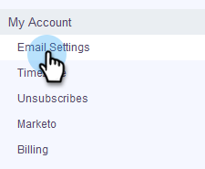

# Konfigurera leveranskanalen {#setting-up-your-delivery-channel}

När du börjar använda Marketo Sales Connect måste du konfigurera en SMTP-server för att kunna skicka ut e-postmeddelanden.

>[!NOTE]
>
>Förutom att konfigurera SMTP-servern måste din [e-postidentitet verifieras](http://docs.marketo.com/x/ewPh) innan du kan skicka e-postmeddelanden.

Du kan välja att skicka e-post med en anpassad SMTP-server, en Team SMTP-server eller Gmail som leveranskanal. Vi går igenom varje alternativ.

## Anpassad SMTP {#custom-smtp}

1. Logga in på [webbprogrammet](http://toutapp.com/login), klicka på kugghjulsikonen uppe till höger och välj **Inställningar**.

   

1. Klicka på **E-postinställningar** under Mitt konto.

   

1. Välj **SMTP-server**.

   

1. Ange dina autentiseringsuppgifter för SMTP-servern och klicka på **Anslut**.

   

   >[!NOTE]
   >
   >Om det här är din enda leveranskanal tilldelas den automatiskt till alla dina e-postidentiteter, och du gör det här. Om detta inte är den enda leveranskanalen, fortsätt till steg 5.

1. Klicka på **Adress och signatur** medan du fortfarande är i E-postinställningar.

   

1. Leta reda på e-postadressen som du vill välja en leveranskanal för och klicka på **Välj leveranskanal**.

   

1. Klicka på **Redigera** på leveranskortet.

   

1. Klicka på listrutan Kanal och välj den anpassade leveranskanal som du just lade till. Klicka på **Spara**.

   

   >[!NOTE]
   >
   >Om teamadministratören konfigurerar teamets SMTP-server gäller den automatiskt bara din standardidentitet för e-post och är tillgänglig som ett alternativ för dina andra e-postidentiteter.

   **Se en video**`<iframe width="630" height="470" src="//play.vidyard.com/YWKSgZvBEjUU8FrXZ5hdYR.html?v=3.1.1" frameborder="0" allowfullscreen></iframe>`

## Team SMTP-server {#team-smtp-server}

>[!NOTE]
>
>**Administratörsbehörigheter krävs**

1. Logga in på [webbprogrammet](http://toutapp.com/login), klicka på kugghjulsikonen uppe till höger och välj **Inställningar**.

   

1. Klicka på **Team SMTP Server** under Administratörsinställningar.

   

1. Ange dina autentiseringsuppgifter för SMTP-servern och klicka på **Anslut**.

   

   >[!NOTE]
   >
   >Teamets SMTP-server kommer att vara standardleveranskanalen för standardidentiteten för e-post för alla teammedlemmar. Dessutom kommer den att vara tillgänglig som ett alternativ för leveranskanal för alla andra e-postidentiteter.

   ** Se en video**`<iframe width="630" height="470" src="//play.vidyard.com/Ky9EwGmLcgvsMpFq3H8Y6n.html?v=3.1.1" frameborder="0" allowfullscreen></iframe>`

## Gmail {#gmail}

1. Logga in på [webbprogrammet](http://toutapp.com/login), klicka på kugghjulsikonen uppe till höger och välj **Inställningar**.

   

1. Klicka på **E-postinställningar** under Mitt konto.

   

1. Klicka på **E-postsynkronisering**.

   

1. Klicka på **Anslut till Google**.

   

1. Logga in med dina Google-inloggningsuppgifter.
1. När du kommer till den här skärmen klickar du på **Tillåt**.

   

   >[!NOTE]
   >
   >Om det här är din enda leveranskanal tilldelas den automatiskt till alla dina e-postidentiteter, och du gör det här. Om Gmail inte är den enda leveranskanalen fortsätter du till steg 7.

1. Klicka på **Adress och signatur**.

   

1. Klicka på den e-postadress som du vill att Gmail ska vara leveranskanal för.

   

1. Bläddra nedåt till leveranskortet när bildrutepanelen öppnas.

   

1. Klicka på listrutan Kanal och välj den Gmail-leveranskanal som du nyss lade till. Klicka på **Spara**.

   

   >[!NOTE]
   >
   >Om teamadministratören konfigurerar teamets SMTP-server gäller den automatiskt bara din standardidentitet för e-post och är tillgänglig som ett alternativ för dina andra e-postidentiteter.

