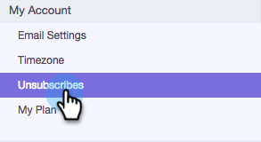

# Anpassa meddelande om att avbryta prenumerationen {#customize-unsubscribe-link-message}

Vi har alltid tillåtit team att anpassa sina länkmeddelanden för att avbryta prenumerationen, men nu kan administratörer ställa in länkmeddelanden för att avbryta prenumerationen för hela teamet så att de får ett enhetligt budskap.

>[!NOTE]
>
>Du kan inte använda en länk för att avbryta prenumerationen från tredje part med Sales Connect eftersom den här informationen inte kommer att hämtas tillbaka till vår databas.

## Anpassa meddelanden för dig själv {#customize-messaging-for-yourself}

1. Logga in på [webbprogrammet](http://toutapp.com/login), klicka på kugghjulsikonen överst till höger och välj **Inställningar**.

   

1. Välj **Avbeställ** under Mitt konto.

   

1. Skriv dina anpassade meddelanden i textrutan.

   

1. Markera den text du vill att användarna ska klicka på för att komma till sidan för att avbryta prenumerationen och klicka sedan på länkikonen.

   

   >[!NOTE]
   >
   >Det spelar ingen roll vilken URL:en är som hyperlänkas. När e-postmeddelandet skickas konverteras hyperlänken till länken för att avbryta prenumerationen.

1. Klicka på **OK**.

   

## Ange avanmälningsmeddelanden för ditt team {#set-unsubscribe-messaging-for-your-team}

1. Logga in på [webbprogrammet](http://toutapp.com/login), klicka på kugghjulsikonen överst till höger och välj **Inställningar**.

   

1. Välj **Avbeställ** under Administratörsinställningar.

   

1. Anpassa meddelandet och klicka på **Spara** när du är klar.

   

1. Välj **Jag ställer in standardmeddelandet för mitt team** så att meddelandet gäller alla användare.

   

