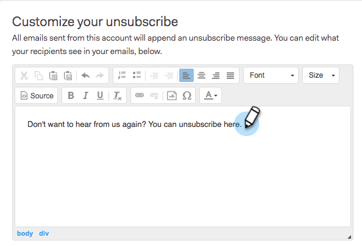

# Anpassa meddelande om att avbryta prenumeration på länk {#customize-unsubscribe-link-message}

Vi har alltid tillåtit team att anpassa sina länkmeddelanden för att avbryta prenumerationen, men nu kan administratörer ställa in länkmeddelanden för att avbryta prenumerationen för hela teamet så att de får ett enhetligt budskap.

>[!NOTE]
>
>Du kan inte använda en länk för att avbryta prenumerationen från tredje part med [!DNL Sales Connect] eftersom den här informationen inte kommer att hämtas tillbaka till vår databas.

## Anpassa meddelanden för dig själv {#customize-messaging-for-yourself}

1. Logga in på [webbprogrammet](https://toutapp.com/login), klicka på kugghjulsikonen uppe till höger och välj **[!UICONTROL Settings]**.

   

1. Välj [!UICONTROL My Account] under **[!UICONTROL Unsubscribes]**.

   

1. Skriv dina anpassade meddelanden i textrutan.

   

1. Markera den text du vill att användarna ska klicka på för att komma till sidan för att avbryta prenumerationen och klicka sedan på länkikonen.

   

   >[!NOTE]
   >
   >Det spelar ingen roll vilken URL:en är som hyperlänkas. När e-postmeddelandet skickas konverteras hyperlänken till länken för att avbryta prenumerationen.

1. Klicka på **[!UICONTROL OK]**.

   

## Ange avbeställningsmeddelanden för ditt team {#set-unsubscribe-messaging-for-your-team}

1. Logga in på [webbprogrammet](https://toutapp.com/login), klicka på kugghjulsikonen uppe till höger och välj **[!UICONTROL Settings]**.

   

1. Välj [!UICONTROL Admin Settings] under **[!UICONTROL Unsubscribes]**.

   

1. Anpassa meddelandet och klicka på **[!UICONTROL Save]** när du är klar.

   

1. Välj **[!UICONTROL I am setting the default messaging for my team]** om du vill att meddelandet ska gälla för alla användare.

   
