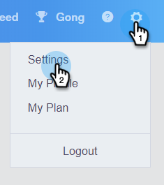

# Marketo Avbeställ kontroll {#marketo-unsubscribe-check}

Marketo Unsubscribe Check använder teamets anslutning till Marketför att förhindra att e-postmeddelanden skickas till personer som har avbrutit prenumerationen i Marketos Lead Management-system. När en säljanvändare skickar ett e-postmeddelande med Sales Connect, görs ett API-anrop till Marketo för att kontrollera om e-post-ID:t har avbrutits. I så fall blockerar vi e-postmeddelandet från att skickas.

>[!NOTE]
>
>**Administratörsbehörigheter krävs**

## Aktiverar {#turning-it-on}

1. Klicka på kugghjulsikonen i webbprogrammet och välj **Inställningar**.

   

1. Klicka på **Avbeställ** under Administratörsinställningar.

   

1. Klicka på **Integrationer**.

   

1. Klicka på skjutreglaget i avsnittet Marketo Unsubscribe Check (Avsluta prenumeration) för att aktivera kontrollen.

   

## Saker att veta {#things-to-know}

Marketo Unsubscribe check..

* Räknas inte med dina API-gränser
* Kräver en Marketo-anslutning
* Är en global inställning
* Blockerar e-postmeddelanden som skickas från webbprogrammet, e-postklienter och Salesforce

