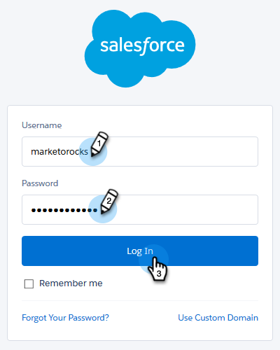

# Synkronisera avbeställningar med Salesforce {#syncing-unsubscribes-with-salesforce}

## Krav för att avbryta prenumerationen på Synkronisera med Salesforce {#requirements-for-unsubscribes-to-sync-to-salesforce}

* Synkronisering av avbruten prenumeration måste vara aktiverat (för nightly sync)
* Fältet Avanmäl dig måste vara installerat i Salesforce
* Personposter i Sales Connect måste ha ett Salesforce-ID

**Push Unsubscribe**

När en avanmälan samlas in i Sales Connect skickar vi den till Salesforce i realtid och uppdaterar något av de avanmälningsfält som du har valt att synkronisera med. Om du har inaktiverat Salesforce-synkroniseringen kommer vi fortfarande att pusha över avbeställningen till avanmälan via e-post.

**Avbeställ synkronisering**

När du har aktiverat synkroniseringen för att avbryta prenumerationen (steg 3 nedan) aktiveras synkroniseringen varje natt. Synkroniseringen sker en gång om dagen runt kl. 20.00 PST. Den synkroniserar alla avregistreringar i MSE/ToutApp dubbelriktat med avanmälningsfältet i Salesforce.

## Konfigurera Synkronisera för att avbryta prenumeration för Salesforce {#configure-unsubscribe-sync-to-salesforce}

Användare kan bestämma sig för om de vill synkronisera sin avanmälan med standardfältet för avanmälan via e-post som Marketo också kan synkronisera med, eller så kan de synkronisera med fältet Marketo Sales Opt Out så att avanmälan av försäljning och avregistrering av marknadsföring kan differentieras.

1. Gå till [webbprogrammet](http://toutapp.com/login), klicka på kugghjulsikonen och välj **Inställningar**.

   

1. Välj **Avbeställ** under Administratörsinställningar.

   

1. Klicka på **Synkronisera till Salesforce** och aktivera sedan nattsynkroniseringen.

   

1. Markera fältet som du vill synkronisera till.

   

   | **Synkronisera med Salesforce-alternativfält** | Markerat som standard uppdaterar bara Salesforce-alternativfältet. |
   |---|---|
   | **Synkronisera med Marketo förs.avanmäl dig** | Om du vill avgränsa försäljning och marknadsföring väljer du det här alternativet för att uppdatera ytterligare [avanmäl försäljning.](#msoo) |

## Installera avanmälningsfältet i sidlayouten {#installing-the-opt-out-field-in-the-page-layout}

**Avanmäl dig via e-post**

Avanmäl dig via e-post är ett standardfält i Salesforce som kan installeras från Salesforce. Du måste vara Salesforce-administratör för att kunna installera det.

1. Gå till [Salesforce.com](http://Salesforce.com) och logga in.

   

1. Klicka på ditt användarnamn och välj **Konfigurera**.

   

1. I snabbsökningsrutan söker du efter antingen Kontakt eller Lead. I det här scenariot installerar vi fältet till kontaktsidans layout, men du vill installera för båda personposterna.

   

1. Välj **Sidlayouter**.

   

1. Välj **Redigera** bredvid sidlayouten som du vill lägga till fältet i.

   

1. Markera **fält**.

   

1. Dra och släpp e-postavanmälan till sidlayouten.

   

1. Klicka på **Spara**.

   

## Marketo - säljavanmälan {#marketo-sales-opt-out}

Marketo Sales Opt Out-fältet är ett anpassat fält som är tillgängligt för användare som har installerat Marketo Sales Connect Customizations.

När du har installerat Marketo Sales Connect Customizations i Salesforce visas fältet Marketo Sales Opt Out.
