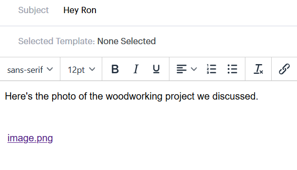

# Lägg till en bifogad fil eller spårbart innehåll i din e-post {#add-an-attachment-or-trackable-content-to-your-email}

När du skickar ett e-postmeddelande via Sales Connect kan du lägga till en fil som en bifogad fil eller göra en fil till en hämtningsbar (och spårbar) länk.

## Lägg till en bifogad fil {#add-an-attachment}

1. Skapa ditt e-postutkast (det finns flera sätt att göra detta, i det här exemplet väljer vi **Disponera** i sidhuvudet).

   

1. Fyll i fältet Till och ange ett ämne.

   

1. Klicka på ikonen för bifogade filer.

   

1. Markera filen som du vill bifoga och klicka på **Infoga**.

   

   >[!NOTE]
   >
   >Om du behöver överföra en fil klickar du på knappen **Överför innehåll** i fönstrets övre högra hörn.

   

Den bifogade filen visas längst ned i e-postmeddelandet.

## Lägg till spårbart innehåll {#add-trackable-content}

1. Skapa e-postutkast (det finns flera sätt att göra detta, i det här exemplet väljer vi fönstret Disponera).

   

1. Fyll i fältet Till och ange ett ämne.

   

1. Klicka på den plats i e-postmeddelandet där du vill att det spårbara innehållet ska visas och klicka på bilageikonen.

   

1. Markera det innehåll du vill lägga till, klicka på reglaget **Innehållet är spårat** och klicka på **Infoga**.

   

   >[!NOTE]
   >
   >Om du behöver överföra en fil klickar du på knappen **Överför innehåll** i fönstrets övre högra hörn.

   Innehållet visas som en länk i ditt e-postmeddelande. Mottagaren kan klicka på länken för att hämta innehållet.

   

   >[!NOTE]
   >
   >Användarna meddelas i Live Feed när de visar sitt spårade innehåll. Användarna kan även se det innehåll som har högst prestanda i innehållsavsnittet på sidan Analytics.

