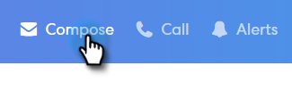

# Lägg till en bifogad fil eller spårbart innehåll i din e-post {#add-an-attachment-or-trackable-content-to-your-email}

När du skickar ett e-postmeddelande via [!DNL Sales Connect] kan du lägga till en fil som en bifogad fil eller göra en fil till en hämtningsbar (och spårbar) länk.

>[!NOTE]
>
>Vanligtvis är alla filer som är större än 20 MB för stora för att kunna levereras. Storleken på en bifogad fil som du kan skicka via e-post varierar beroende på vilken e-postleveranskanal du använder.

## Lägg till en bifogad fil {#add-an-attachment}

1. Skapa ditt e-postutkast (det finns flera sätt att göra detta, i det här exemplet väljer vi **[!UICONTROL Compose]** i sidhuvudet).

   

1. Fyll i fältet [!UICONTROL To] och ange en [!UICONTROL Subject].

   

1. Klicka på ikonen för bifogade filer.

   

1. Markera filen som du vill bifoga och klicka på **[!UICONTROL Insert]**.

   

   >[!NOTE]
   >
   >Om du behöver överföra en fil klickar du på knappen **Överför innehåll** i fönstrets övre högra hörn.

   

Den bifogade filen visas längst ned i e-postmeddelandet.

## Lägg till spårbart innehåll {#add-trackable-content}

1. Skapa ditt e-postutkast (det finns flera sätt att göra detta, i det här exemplet väljer vi [!UICONTROL Compose]-fönstret).

   

1. Fyll i fältet [!UICONTROL To] och ange en [!UICONTROL Subject].

   

1. Klicka på den plats i e-postmeddelandet där du vill att det spårbara innehållet ska visas och klicka på bilageikonen.

   

1. Markera det innehåll som du vill lägga till, klicka på skjutreglaget **[!UICONTROL Content is tracked]** och klicka på **[!UICONTROL Insert]**.

   

   >[!NOTE]
   >
   >Om du behöver överföra en fil klickar du på knappen **Överför innehåll** i fönstrets övre högra hörn.

   Innehållet visas som en länk i ditt e-postmeddelande. Mottagaren kan klicka på länken för att hämta innehållet.

   

   >[!NOTE]
   >
   >Användarna meddelas i Live Feed när de visar sitt spårade innehåll. Användarna kan även se det innehåll som har högst prestanda i innehållsavsnittet på sidan Analytics.
