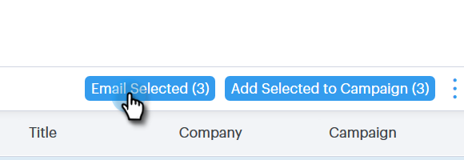

# Disponera massutskick med Select och Send {#composing-bulk-emails-with-select-and-send}

Så här skickar/redigerar du e-postmeddelanden med alternativet Markera och skicka.

## Skickar e-postmeddelanden {#sending-emails}

1. Navigera till sidan Personer.

   

1. Markera de personer som du vill skicka e-post till.

   

   >[!NOTE]
   >
   >Högst 200 personer kan väljas när du använder Markera och Skicka.

1. Klicka på knappen **E-post markerad**.

   

1. Ange en ämnesrad, välj en mall (eller skapa e-postmeddelandet från grunden) och skicka/ [schemalägg](http://docs.marketo.com/x/GAQ6Ag)e-postmeddelandet.

   

   >[!NOTE]
   >
   >Om du har valt en mall och vill kontrollera att alla dynamiska fält fylls i korrekt innan du skickar dem klickar du på **Förhandsgranska dynamiska fält**. Se till att alla mottagare i det stora sidofältet är markerade för att förhandsgranska alla e-postmeddelanden. Om du markerar ett e-postmeddelande och klickar på **Förhandsgranska dynamiska fält** förhandsgranskas endast det e-postmeddelandet.

## Redigera e-postmeddelanden {#editing-emails}

**Massredigeringar**

1. Följ steg 1-3 i avsnittet [Skicka e-post](http://docs.marketo.com/display/DOCS/Composing+Bulk+Emails+with+Select+and+Send#ComposingBulkEmailswithSelectandSend-SendingEmails).

   >[!NOTE]
   >
   >Som standard markeras alla mottagare. Om du klickar på en individ och vill markera alla igen klickar du på **Alla mottagare**. Som påminnelse måste alla mottagare vara markerade för att kunna göra massredigeringar.

1. Gör ändringarna i redigeraren. Du kan skapa ett nytt e-postmeddelande eller redigera en mall (i det här exemplet skapar vi ett nytt e-postmeddelande).

   

   >[!NOTE]
   >
   >Du kan klicka på en viss e-postmottagare för att se ändringarna som har skickats till det e-postmeddelandet.

1. Klicka på **Skicka** (eller [Schemalägg](http://docs.marketo.com/x/GAQ6Ag)) för att skicka till alla mottagare med de satsvisa e-postuppdateringarna som du har gjort.

   

**Redigera alla e-postmeddelanden**

Slutför gruppuppdateringar innan du anpassar varje e-postmeddelande, eftersom en gruppuppdatering skriver över ändringar i alla e-postmeddelanden i det stora sidofältet.

1. Följ steg 1-4 i avsnittet [Skicka e-post.](http://docs.marketo.com/display/DOCS/Composing+Bulk+Emails+with+Select+and+Send#ComposingBulkEmailswithSelectandSend-SendingEmails)

   >[!NOTE]
   >
   >Som standard markeras alla mottagare. Om du klickar på en individ och vill markera alla igen klickar du på **Alla mottagare**. Som påminnelse måste alla mottagare vara markerade för att kunna göra massredigeringar.

1. Välj en enskild mottagare.

   

1. Gör ändringarna i redigeraren.

   

   >[!NOTE]
   >
   >Här kan du redigera ett enda e-postmeddelande i grupplisten utan att uppdatera resten av e-postmeddelandena.

   >[!TIP]
   >
   >Du kan klicka på andra mottagare för att se att de ändringar du har gjort för den tidigare valda mottagaren inte visas.

1. Klicka på **Skicka** (eller [Schemalägg](http://docs.marketo.com/x/GAQ6Ag)) för att skicka till alla mottagare med de satsvisa e-postuppdateringarna som du har gjort.

   

   >[!MORELIKETHIS]
   >
   >
   >    
   >    
   >    * [Alternativ för massutskick](http://docs.marketo.com/x/HwQ6Ag)
   >    * [Använda en mall i dispositionsfönstret](http://docs.marketo.com/x/MQQ6Ag)
   >    * [Dynamiska fält](http://docs.marketo.com/x/wwDb)

