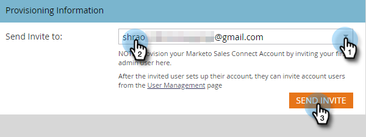

# Åtkomst till din nya Sales Connect-instans {#accessing-your-new-sales-connect-instance}

>[!NOTE]
>
>**Administratörsbehörighet krävs.**

När Sales Connect har köpts visas en ny integreringssida i din Marketo-instans. Använd den här sidan om du vill bjuda in din första användare och etablera deras Sales Connect-instans.

1. Klicka på **Admin** i Marketo.

   

1. Klicka på **Sales Connect**.

   

1. Välj i en lista över Marketo-administratörer som ska bjudas in och klicka på **Skicka inbjudan**.

   

Användaren får ett e-postmeddelande med instruktioner för att få tillgång till Sales Connect-kontot.

>[!NOTE]
>
>Ytterligare användare kommer **inte** att läggas till via Marketo och läggs istället till via sidan Användarhantering i Sales Connect. [Klicka här ](/help/marketo/product-docs/marketo-sales-connect/admin/invite-users.md) om du vill veta mer om hur du lägger till fler användare.
