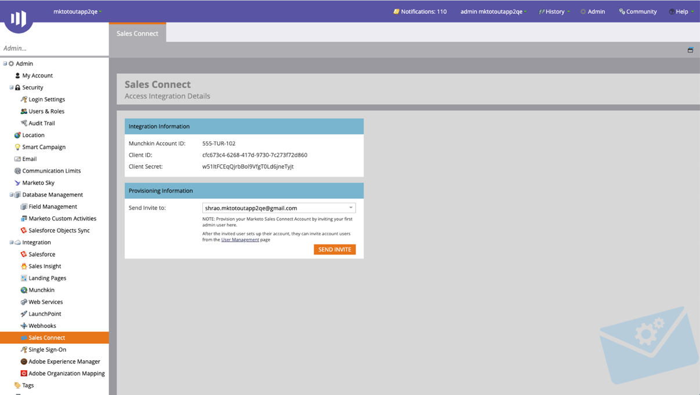
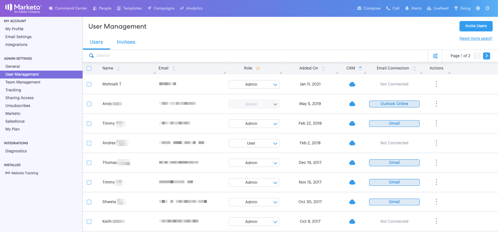
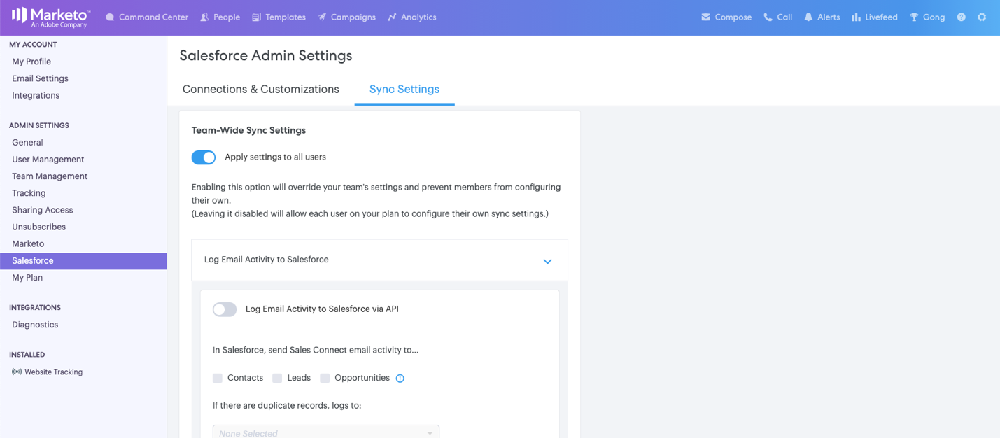

# Starthandbok för [!DNL Sales Connect]-administratörer {#getting-started-guide-for-sales-connect-admins}

Det här dokumentet tar dig igenom de inledande stegen för att konfigurera din nya [!DNL Sales Connect]-instans. Vissa av dessa steg kräver åtkomst som Marketo-administratör, [!DNL Salesforce]-administratör och [!DNL Sales Connect]-administratör. Följ våra guider nedan för att slutföra instanskonfigurationen.

>[!NOTE]
>
>**Administratörsbehörighet krävs.**

## Gå till ditt nya Marketo Sales Connect-konto {#accessing-your-new-marketo-sales-connect-account}

Om du har köpt Marketo Sales Connect får du tillgång till din instans via Marketo administratörssektion. [Klicka här](/help/marketo/product-docs/marketo-sales-connect/getting-started/accessing-your-new-sales-connect-instance.md){target="_blank"} om du vill se instruktioner om hur en Marketo-administratör kan ge åtkomst till din nya instans.

## Bjuda in och hantera användare {#inviting-and-managing-users}

När du har etablerat ditt Marketo Sales Connect-konto från Marketo och bjudit in den första administratörsanvändaren kan den administratörsanvändaren bjuda in ytterligare användare från Marketo Sales Connect-användarhanteringssidan. [Klicka här](/help/marketo/product-docs/marketo-sales-connect/admin/invite-users.md){target="_blank"} om du vill se hur du bjuder in användare från sidan för användarhantering.

## Ansluter till [!DNL Salesforce] {#connecting-to-salesforce}

Alla användare måste ansluta till [!DNL Salesforce] separat för att kunna aktivera loggförsäljningsaktiviteter för Salesforce, som e-post, samtal och uppgifter. När du ansluter till Salesforce som administratör har du dock möjlighet att konfigurera dina inställningar för aktivitetsloggning för hela teamet så att globala loggningsinställningar tillämpas för alla [!DNL Sales Connect]-användare.

Följ stegen i [den här artikeln](/help/marketo/product-docs/marketo-sales-connect/crm/salesforce-integration/connect-your-sales-connect-account-to-salesforce.md){target="_blank"} för att ansluta din Sales Connect-instans till din Salesforce-instans som administratör eller icke-administratör.

## Ansluta till Marketo {#connecting-to-marketo}

Om ni ansluter till Marketo kan era säljare utnyttja kraften i marknadsföringsautomatisering och marknadsföringsinsikter i sina prospekteringsinsatser. Följande funktioner kräver att du konfigurerar en integrering med Marketo.

* Dela [marknadsföringskampanjer](/help/marketo/product-docs/marketo-sales-connect/marketo/make-a-campaign-visible-to-sales-connect-users.md){target="_blank"} med säljare
* Skjut [intressanta stunder](/help/marketo/product-docs/marketo-sales-connect/marketo/interesting-moments-in-sales-connect.md){target="_blank"} till Live-feed
* Loggar säljaktiviteter till Marketo

[Klicka här](/help/marketo/product-docs/marketo-sales-connect/marketo/set-up-your-marketo-connection.md){target="_blank"} om du vill veta mer om hur du ansluter till Marketo och ger säljarna åtkomst till anslutningen.

## Installerar anpassningspaket för [!DNL Salesforce] {#installing-salesforce-customization-package}

En del av att säkerställa att försäljningen är aktiverad för framgång är att ha rätt funktioner på sin primära arbetsyta. Anpassningspaketet Sales Connect gör det möjligt att komma åt engagemangsfunktioner och viktiga attribut för försäljningsaktiviteter från Salesforce.

[Klicka här](/help/marketo/product-docs/marketo-sales-connect/crm/salesforce-customization/sales-connect-customizations-for-crm.md){target="_blank"} om du vill veta mer om hur du installerar anpassningen av Sales Connect.

## Testning i sandlådan {#testing-in-sandbox}

För team som vill testa Marketo Sales Connect med sin Marketo Sandbox kan ytterligare ett Sales Connect-konto etableras på begäran. Detta gäller endast kunder som har köpt en Marketo Sandbox, eller kunder som har den som en del av deras Marketo-paket. Kontakta din kontoansvarige på Marketo om du är intresserad av att köpa en sandlåda.

>[!NOTE]
>
>Du kan inte etablera ett Sales Connect-konto med samma e-post-ID till flera instanser. Det innebär att om du vill ha ett extra Sales Connect-konto för att testa med din Marketo Sandbox-instans måste du använda ett annat e-post-ID för varje konto.

>[!MORELIKETHIS]
>
>[Administratörsprivilegier](/help/marketo/product-docs/marketo-sales-connect/admin/user-access-details.md){target="_blank"}
