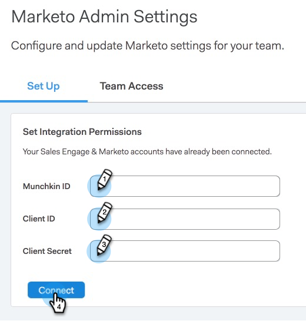

# Komma igång med Sales Connect {#getting-started-with-sales-connect}

Om du hellre vill titta på de här stegen än att läsa dem går du direkt till [videoinstruktionerna nedan](#video).

>[!AVAILABILITY]
>
>Alla kunder har inte köpt den här funktionen. Kontakta din Customer Success Manager om du vill ha mer information.

## Vad du behöver för att komma igång {#what-you-need-to-get-started}

* Marketo-prenumeration
* prenumeration på Sales Connect
* Salesforce-prenumeration (med API-anrop och Apex-klasser aktiverade)

## Vem du behöver för att komma igång {#who-you-need-to-get-started}

* Marketo Admin-användare
* Administratörsanvändare för Sales Connect
* Salesforce-administratör
* Sales Connect-användare

## Administratörer för Sales Connect {#sales-connect-admins}

Du får ett e-postmeddelande från Marketo med en länk för att återställa lösenordet. När du har skapat ett nytt lösenord loggar du in på Sales Connect.

För att slutföra installationen måste du göra följande:

* [Connect Sales Connect och Salesforce](#sfdc)
* [Hämta autentiseringsuppgifter innan du kopplar säljkontakt med Marketo](#acquire)
* [Connect Sales Connect with Marketo](#mkto)
* [Bjud in/etablera användare](#IPU)

Du kan också:

* [Testa Sales Connect i din sandlåda](#sandbox)

## Anslut ditt Sales Connect-konto till Salesforce {#connect-your-sales-connect-account-to-salesforce}

Om du vill ansluta ditt Sales Connect-konto till ditt Salesforce-konto, som administratör eller annan administratör, följer du stegen i [den här artikeln](http://docs.marketo.com/x/JwDb).

>[!NOTE]
>
>Den Salesforce-instans som du ansluter till måste vara samma instans som är (eller kommer att vara) ansluten till Marketo.

## Hämtar autentiseringsuppgifter innan du kopplar upp Sales Connect med Marketo {#acquiring-credentials-prior-to-connecting-sales-connect-with-marketo}

Du måste hämta en uppsättning inloggningsuppgifter inifrån Marketo. Dessa autentiseringsuppgifter används senare av Sales Connect Admin för att ansluta Marketo till Sales Connect.

1. I Marketo klickar du på **Admin**.

   

1. Klicka på **Sales Connect** i trädet.

   

1. Välj och skicka följande Marketto-inloggningsuppgifter till din Sales Connect-administratör: Munchkin-ID, klient-ID, klienthemlighet.

   

   >[!NOTE]
   >
   >När du kopierar och klistrar in ovanstående information bör du kontrollera att inga mellanslag läggs till.

## Anslut försäljningsanslutning till Marketo {#connect-sales-connect-to-marketo}

1. Klicka på kugghjulsikonen i Sales Connect och välj **Inställningar**.

   

1. Under Administratörsinställningar väljer du **Marketo**.

   

1. Ange Marketo-inloggningsuppgifterna från Marketo Admin och klicka på **Anslut**.

   

## Bjud in/etablera användare {#invite-provision-users}

Om det redan finns användare på ditt konto (tidigare från ToutApp) visas de på fliken **Teamåtkomst** i Marketo-avsnittet i Sales Connect.

Du kan distribuera ditt team som Marketo Sales Connect User från den här sidan. Om du aldrig har använt ToutApp, eller ännu inte har bjudit in användare, följer du stegen i [den här artikeln](http://docs.marketo.com/display/TOUT/Invite+Team+Members).

>[!CAUTION]
>
>Vänta tio minuter efter att du har anslutit Sales Connect med Marketo innan du utför dessa steg.

1. Markera en eller flera användare och klicka sedan på **Anslut**.

   >[!NOTE]
   >
   >Du kan bara utföra arbetsytetilldelningen en gång när du bjuder in användare. När den är inställd måste du koppla från användaren för att kunna ändra den.

   

1. Om din Marketo-prenumeration har arbetsytor aktiverade kan du tilldela arbetsytor till varje användare eller grupp av användare samtidigt. Om inga arbetsytor är markerade tilldelas de till standardarbetsytan Marketo.

   

1. Klicka på listrutan Arbetsyta, välj önskad arbetsyta och klicka på **Anslut**.

   

   >[!NOTE]
   >
   >Om du vill lägga till nya användare går du till avsnittet Teamhantering i Administrationsinställningar och klickar på knappen **Bjud in användare**.

Du kan få fler användare från sidan Teamhantering och följa stegen ovan för att få dem anslutna.

## Testa Säljanslutning i din sandlåda {#test-sales-connect-in-your-sandbox}

För team som vill testa Marketo Sales Connect med sin Marketo Sandbox kan ytterligare ett Sales Connect-konto etableras på begäran. Detta gäller endast kunder som har köpt en Marketo Sandbox, eller kunder som har den som en del av sitt Marketo-paket. Om du är intresserad av att köpa en sandlåda kontaktar du er kontoansvarige på Marketo.

>[!NOTE]
>
>Du kan inte etablera ett Sales Connect-konto med samma e-post-ID till flera instanser. Det innebär att om du vill ha ett extra Sales Connect-konto för att testa med din Marketo Sandbox-instans måste du använda ett annat e-post-ID för varje konto.
