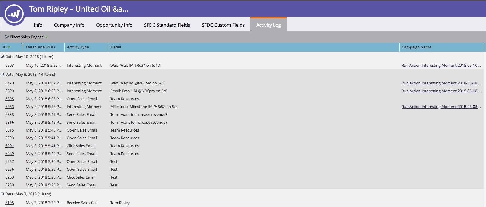

# Översikt över Sales Connect {#sales-connect-overview}

Marketo Sales Connect är en mångfacetterad säljsupport med många olika funktioner som hjälper er att öka engagemanget under hela säljcykeln.

>[!NOTE]
>
>**Tillgänglighet**
>
>Alla kunder har inte köpt den här funktionen. Kontakta din Customer Success Manager om du vill ha mer information.

## The Live Feed {#the-live-feed}

Säljarna kan se hur [både marknadsförings- och säljinnehållet engagerar](http://docs.marketo.com/x/d4TS) i realtid.

## Persondetaljvy {#person-detail-view}

Få [detaljerad personstatistik](http://docs.marketo.com/x/e4TS).

## Se resultaten i din Marketo-aktivitetslogg {#see-results-in-your-marketo-activity-log}

Se hur era prospects engagerar sig i era säljsatsningar.

<table> 
 <tbody> 
  <tr> 
   <th>Typ av aktivitet</th> 
   <th>Beskrivning</th> 
  </tr> 
  <tr> 
   <td>
Skicka e-postmeddelande
</td> 
   <td>
Användaren skickade ett e-postmeddelande från MSE.
</td> 
  </tr> 
  <tr> 
   <td>
Open Sales Email
</td> 
   <td>
Lead öppnade ett säljmejl som skickades från MSE.
</td> 
  </tr> 
  <tr> 
   <td>
Klicka på E-postadress
</td> 
   <td>
Lead klickade på en länk i ett säljmejl som skickats från MSE.
</td> 
  </tr> 
  <tr> 
   <td colspan="1">
Ta emot e-post för försäljning
</td> 
   <td colspan="1">
Lead fick ett e-postmeddelande från MSE.
</td> 
  </tr> 
  <tr> 
   <td colspan="1">
Ta emot försäljningssamtal
</td> 
   <td colspan="1">
Lead tog emot ett samtal från en säljare via <a href="http://docs.marketo.com/x/NgDb" rel="nofollow">telefonen</a>.
</td> 
  </tr> 
  <tr> 
   <td colspan="1">
Lägg till i försäljningskampanj
</td> 
   <td colspan="1">
Lead har lagts till i en försäljningskampanj som skapats i MSE (på kampanjsidan).
</td> 
  </tr> 
  <tr> 
   <td colspan="1">
Borttagen från försäljningskampanj
</td> 
   <td colspan="1">
Lead har tagits bort från en försäljningskampanj.
</td> 
  </tr> 
  <tr> 
   <td colspan="1">
Intressant ögonblick
</td> 
   <td colspan="1">
Lead fick en intressant stund genererad i Marketo.
</td> 
  </tr> 
 </tbody> 
</table>

## Dela marknadsföringskampanjer {#share-marketing-campaigns}

Skapa en enkel smart kampanj som ger era säljanvändare tillgång till [Marketo-kampanjdata](http://docs.marketo.com/x/NwDh).

Vill du komma igång? Klicka på länken nedan om du vill se installationsanvisningar.

>[!MORELIKETHIS]
>
>* [Komma igång med Sales Connect](http://docs.marketo.com/x/coTS)

>

