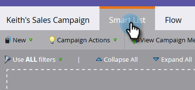
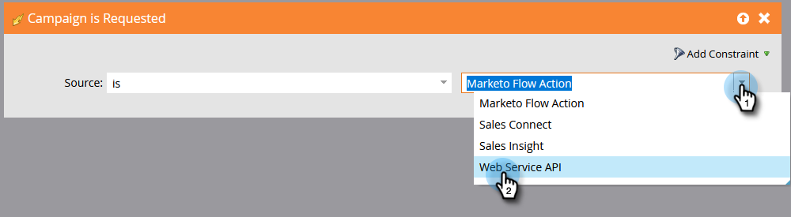

# Gör en kampanj synlig för användare av Sales Connect {#make-a-campaign-visible-to-sales-connect-users}

Kampanjer kan bara delas om de är synliga. Så här gör du.

1. Välj (eller skapa) den kampanj du vill dela.

   

1. Klicka på fliken **Smart lista**.

   

1. Lägg till kampanjutlösaren är begärd.

   

1. Välj is **Webbtjänstens API** som källa.

   

1. Klicka på fliken **Flöde**.

   

1. Lägg till åtgärden Intressant stationsflöde.

   

1. Välj **Webb** som Typ.

   

1. Skriv ett meddelande till ditt säljteam i rutan Beskrivning. I det här exemplet använder vi tokens för att ange formuläret som fylldes i.

   

1. Klicka på fliken **Schema** och **Aktivera** kampanjen.

   
