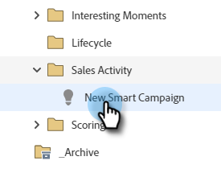

# Utlösare och filter för försäljningsaktivitet {#sales-activity-triggers-and-filters}

Om ni vill koordinera interaktionen med säljarna bättre eller försöka få en bättre bild av hur de interagerar med kunderna under hela kundresan, kommer insikter om försäljningsaktiviteter i Marketo att vara användbara för er.

Följ stegen nedan för att lära dig hur du använder filter för försäljningsaktivitet och utlösare i smarta kampanjer.

1. Hitta och välj den smarta kampanj du vill använda.

   

1. På fliken **Smart List** söker du efter &quot;Sales Connect&quot;.

   

1. Välj önskat filter eller önskad utlösare.

   

1. Välj eventuella begränsningar.

   

>[!NOTE
>
>En fullständig lista över aktiviteter, begränsningar och definitioner finns i vår [Sales Activity Glossary](/help/marketo/product-docs/marketo-sales-connect/marketo/sales-activity-glossary.md).
