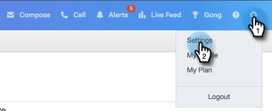
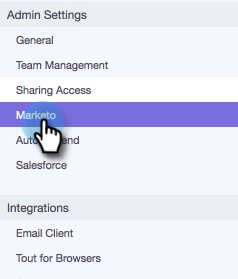

# Konfigurera din Marketo-anslutning {#set-up-your-marketo-connection}

>[!NOTE]
>
>När du etablerar MSC skickar Marketo automatiskt dina autentiseringsuppgifter till [!DNL Sales Connect] och ansluter instansen till Marketo. Det här steget krävs **endast om du inte ser anslutningen som upprättats** efter att [!DNL Sales Connect]-instansen har etablerats. Om anslutningen är upprättad ser du dina inloggningsuppgifter på sidan Marketo Admin Settings.

## Hämtar autentiseringsuppgifter innan [!DNL Sales Connect] ansluts till Marketo {#acquiring-credentials-prior-to-connecting-sales-connect-with-marketo}

Du måste hämta en uppsättning inloggningsuppgifter från Marketo. Dessa autentiseringsuppgifter används senare av [!DNL Sales Connect]-administratören för att ansluta Marketo till [!DNL Sales Connect].

1. Klicka på **[!UICONTROL Admin]** i Marketo.

   

1. Klicka på **[!UICONTROL Sales Engage]** i trädet.

   

1. Markera och skicka följande Marketo-autentiseringsuppgifter till din [!DNL Sales Connect]-administratör: [!UICONTROL Munchkin Account ID], [!UICONTROL Client ID], [!UICONTROL Client Secret].

   

   >[!NOTE]
   >
   >När du kopierar och klistrar in ovanstående information bör du kontrollera att inga mellanslag läggs till.

## Anslut [!DNL Sales Connect] till Marketo {#connect-sales-connect-to-marketo}

1. Klicka på kugghjulsikonen i [!DNL Sales Connect] och välj **[!UICONTROL Settings]**.

   

1. Välj [!UICONTROL Admin Settings] under **[!UICONTROL Marketo]**.

   

1. Ange de Marketo-autentiseringsuppgifter som tillhandahålls av Marketo Admin och klicka på **[!UICONTROL Connect]**.

   
