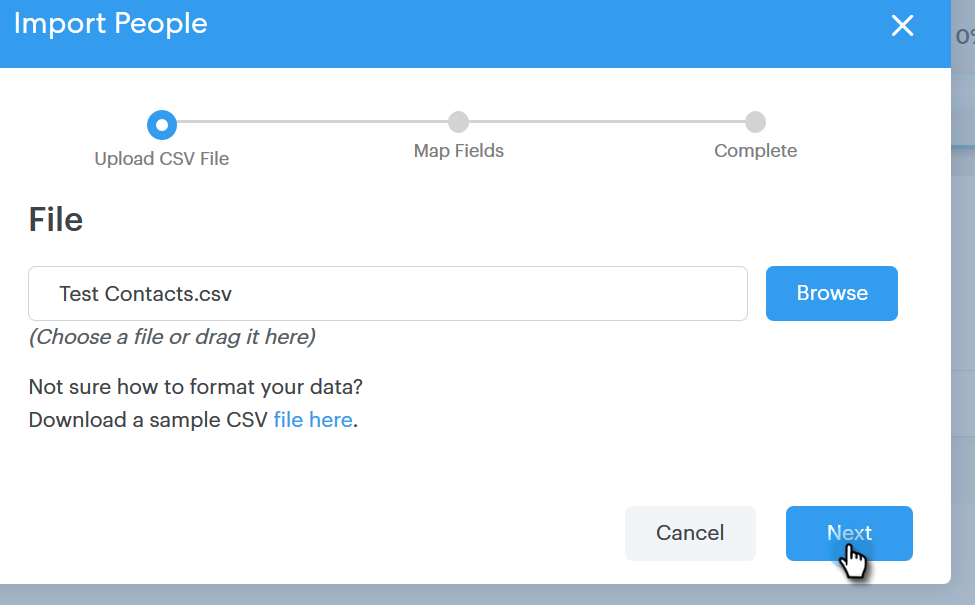

# Importera kontakter via CSV {#import-contacts-via-csv}

Det är viktigt att ha kontakter på personsidan eftersom det är där vi går från till att automatiskt fylla i personlig information i de dynamiska fälten i dina mallar. Se till att du har minst ett namn och en e-postadress för varje kontakt i CSV-filen och att du mappar till dessa fält.

1. Markera gruppen (eller skapa en ny) på fliken Personer.

   

1. Klicka på **Gruppera åtgärder** och välj **Importera CSV**.

   

1. Klicka på **Bläddra**.

   

1. Leta reda på filen på datorn och markera den.

   >[!NOTE]
   >
   >Grupper är begränsade till 1 000 kontakter.

1. Klicka på **Nästa**.

   

1. Mappa kolumnerna i CSV-filen till deras respektive fält i Sales Connect. Klicka på **Nästa** när du är klar.

   

