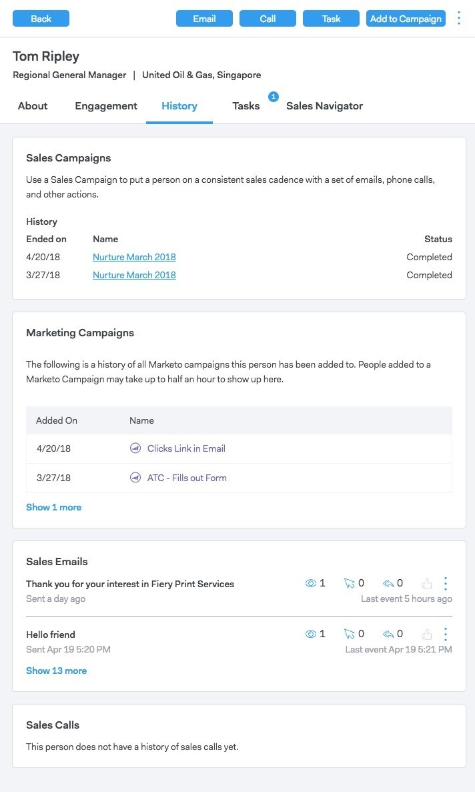

# Persondetaljvy {#person-detail-view}

I persondetaljvyn finns en detaljerad profil för varje person i ditt MSC-konto.

## Åtkomst till {#how-to-access}

1. Klicka på fliken **Personer** för att komma åt vyn med persondetaljer.

   

1. Klicka på önskad person.

   

   >[!TIP]
   >
   >I stort sett var du än ser en persons namn kan du klicka på den och gå till hans/hennes personvy.

## Fliken {#about-tab}

Innehåller all kontaktinformation för personen.

**Kontaktkort**

* Innehåller kontaktinformation som: e-postadress, namn, företag, titel, telefonnummer och länkar till sociala medier

**Grupper**

* Visar och hanterar vilka grupper den här personen är medlem i

**Kontoinformation**

* Kan lägga till en person i Salesforce
* Hämta konto- och lead-/kontaktinformation från Salesforce

**Anpassade fält**

* Lägg till eller ta bort anpassade fält som kan användas som dynamiska fält i mallar och kampanjer

**Anteckningar**

* Skapa anpassade anteckningar

## Engagement Tab {#engagement-tab}

Se hur den här personen engagerar sig i er utåtriktade verksamhet.

**Försäljningsanslutningsaktivitet**

* Se engagemangsaktiviteter från era säljkampanjer via e-post

**Marknadsföring**

* Se hur er person engagerar sig i marknadsföringskampanjer

## Fliken Historik {#history-tab}

Visar din utdatahistorik. Inkluderar e-post, kampanjer och samtal.

**Försäljningskampanjer**

* Se alla aktiva eller slutförda kampanjer som den här personen tillhör

**Marknadsföringskampanjer**

* Se alla marknadsföringskampanjer som den här personen är medlem i

**Försäljningsmejl**

* Visa e-postmeddelanden som du har skickat till den här personen och interaktionsstatistik

**Försäljningssamtal**

* Visa alla samtal du har gjort till den här personen

## Fliken Åtgärder {#tasks-tab}

Hantera uppgifter som är kopplade till den här personen.

Åtgärder du kan utföra:

* Redigera eller ta bort en uppgift
* Se förfallodatumet
* Klicka på Typ för att starta Säljtelefonen om du ringer, E-posta om det är e-post, Länkad om e-post och Anpassad anteckning om det är anpassat.
* Markera en uppgift som slutförd

## Fliken Sales Navigator {#sales-navigator-tab}

Visa LinkedIn-profildata med LinkedIns Sales Navigator.

>[!NOTE]
>
>Sales Navigator är ett betalt tillägg via LinkedIn. Kontakta dem för att få den här funktionen.

Skapa en rapport genom att nämna brytare.

Spara kontakter som leads i Sales Navigator.
