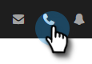

# Utfall för samtal {#call-outcomes}

Låt säljteamen välja samtalsresultat när de ringer samtal så att teamet kan förstå effekten av era kundsatsningar.

>[!NOTE]
>
>**Administratörsbehörighet krävs.**

## Aktivera samtalsutfall {#enable-call-outcomes}

1. Klicka på kugghjulsikonen och välj **[!UICONTROL Settings]**.

   

1. Under [!UICONTROL Admin Settings] väljer du **[!UICONTROL Dialer]**.

   

1. Välj **[!UICONTROL Enable call outcomes]**.

   

1. Välj önskat behov av samtalsutfall.

   

## Skapa samtalsutfall {#create-call-outcomes}

>[!NOTE]
>
>Du kan skapa maximalt 15 Call Outcome.

1. Klicka på kugghjulsikonen och välj **[!UICONTROL Settings]**.

   

1. Under [!UICONTROL Admin Settings] väljer du **[!UICONTROL Dialer]**.

   

1. Klicka på **[!UICONTROL Manage call outcomes]**.

   

1. Ange det önskade namnet på samtalsresultatet i textfältet.

   

1. Klicka på listrutan [!UICONTROL Answered] och välj resultattyp (i det här exemplet väljer vi Answered). Klicka sedan på **[!UICONTROL Add]**.

   

## Välj ett samtalsutfall {#choose-a-call-outcome}

När samtalsresultaten har aktiverats. Användarna kan välja ett när de ringer ett samtal.

1. Klicka på samtalsknappen för att starta uppringaren.

   

1. Ange samtalsinformationen i telefonsvararen och klicka på **[!UICONTROL Call]**.

   

1. Välj det samtalsresultat som bäst beskriver samtalet.

   

1. Avsluta samtalet.

   

1. Logga samtalet.

   

>[!MORELIKETHIS]
>
>* [Logga samtalsorsaker och samtalsresultat till Salesforce](/help/marketo/product-docs/marketo-sales-connect/phone/log-call-reasons-and-call-outcomes-to-salesforce.md)
>* [Anropa orsaker](/help/marketo/product-docs/marketo-sales-connect/phone/call-reasons.md)
