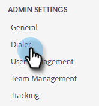
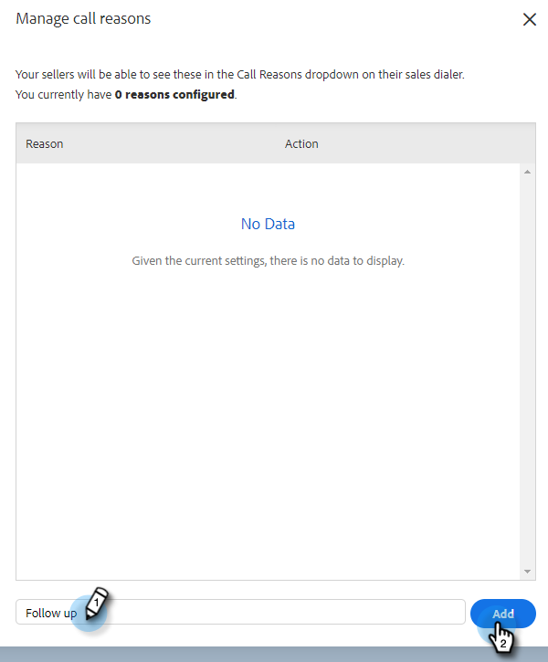

# Samtalsorsaker {#call-reasons}

Låt säljteamen välja samtalsorsaker när de ringer samtal så att teamet kan förstå varför samtal görs.

>[!NOTE]
>
>**Administratörsbehörighet krävs.**

## Aktivera samtalsorsaker {#enable-call-reasons}

1. Klicka på kugghjulsikonen och välj **Inställningar**.

   

1. Under Administratörsinställningar väljer du **Dialer**.

   

1. Välj **Aktivera samtalsorsaker**.

   

1. Välj önskat behov av samtalsorsak.

   

## Skapa samtalsorsak {#create-call}

1. Klicka på kugghjulsikonen och välj **Inställningar**.

   

1. Under Administratörsinställningar väljer du **Dialer**.

   

1. Klicka **Hantera samtalsorsaker**.

   

1. Ange det önskade namnet på samtalsorsaken i textfältet och klicka på **Lägg till**.

   

## Välj en samtalsorsak {#select-a-call-reason}

När samtalsortimenten har aktiverats. Användarna kan välja ett när de ringer ett samtal.

1. Klicka på samtalsknappen för att starta uppringaren.

   PICC

1. Ange samtalsinformationen i telefonsvararen.

   PICC

1. Klicka på ring.

   PICC

1. Välj den anropsorsak som bäst beskriver samtalet.

   PICC

1. Avsluta samtalet.

   PICC

1. Logga samtalet.

   PICC

>[!MORELIKETHIS]
>
>* [Logga samtalsorsaker och samtalsresultat till Salesforce](/help/marketo/product-docs/marketo-sales-connect/phone/log-call-reasons-and-call-outcomes-to-salesforce.md)
>* [Utfall för samtal](/help/marketo/product-docs/marketo-sales-connect/phone/call-outcomes.md)

