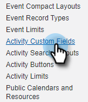
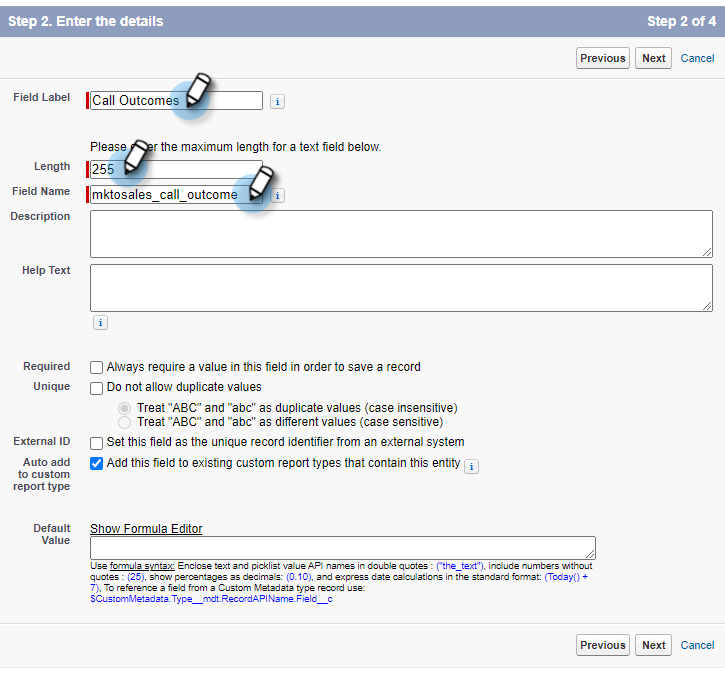
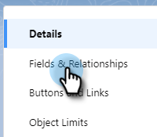
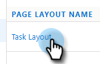
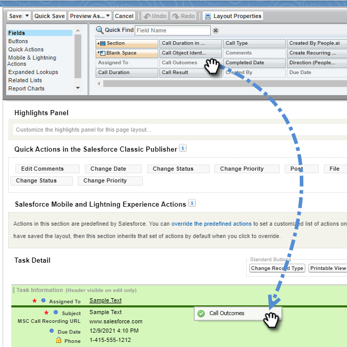

# Logga samtalsorsaker och samtalsresultat till Salesforce {#log-call-reasons-and-call-outcomes-to-salesforce}

Om du vill logga samtalsresultat och anropa orsaker till Salesforce för rapporterings- eller synlighetssyften kan du skapa ett anpassat aktivitetsfält för varje. Varje fält måste ha ett specifikt API-namn (kallas fältnamn i Salesforce).

* Namn på utdatafält för samtal: mktosales_call_result
* Fältnamn för samtalsorsaker: mktosales_call_reason

Om du vill använda dessa fält måste du först skapa fältet som ett anpassat aktivitetsfält. För att göra den synlig för användarna måste du lägga till den i sidolayouten för uppgiftsobjektet.

## Salesforce Classic {#salesforce-classic}

### Skapa anpassat aktivitetsfält i Salesforce Classic  {#create-custom-activity-field-in-salesforce-classic}

1. I Salesforce klickar du på **Inställningar**.

   

1. Skriv&quot;Aktiviteter&quot; i rutan Snabbsökning.

   

1. Klicka **Anpassade aktivitetsfält**.

   

1. Klicka **Nytt**.

   

1. Markera datatypen &quot;Text&quot; och klicka på **Nästa**.

   

1. Ge det anpassade fältet fältnamnet enligt definitionen ovan. Fältlängden får innehålla högst 255 tecken. Fältetiketten är det fält som är synligt för säljteamet och kan anpassas efter teamets behov.

   

1. Resten av inställningarna är valfria. När du är klar med konfigurationen klickar du på **Nästa**.

   

1. Välj önskade säkerhetsinställningar på fältnivå för det här fältet och klicka på **Nästa** (bilden nedan är bara ett exempel).

   

   >[!NOTE]
   >
   >Se till att det anpassade fältet är synligt för den profil som dina Sales Connect-användare använder, tillsammans med alla andra som du vill att det ska vara synligt.

1. Välj vilka sidlayouter du vill lägga till fältet i och klicka på **Spara** (du kan också klicka **Spara och ny** och upprepa processen för fältet Anropsorsak).

   

### Lägg till anpassat aktivitetsfält till aktivitetssidlayout i Salesforce Classic {#add-custom-activity-field-to-task-page-layout-in-salesforce-classic}

>[!NOTE]
>
>Du behöver bara följa dessa steg om du inte har valt önskad sidlayout i steg 9 ovan.

1. I Salesforce klickar du på **Inställningar**.

   

1. Skriv &quot;Aktivitet&quot; i rutan Snabbsökning.

   

1. Klicka **Sidlayout för aktivitet**.

   

1. Klicka **Redigera** intill uppgiftssidans layout vill du lägga till det här fältet i.

   

1. Dra och släpp fältet till önskat avsnitt på sidan Uppgift.

   

1. Klicka **Spara**.

   

## Salesforce Lightning {#salesforce-lightning}

### Skapa anpassat aktivitetsfält i Salesforce Lightning {#create-custom-activity-field-in-salesforce-lightning}

1. Klicka på kugghjulsikonen uppe till höger i Salesforce och välj **Inställningar**.

   

1. Klicka **Objektshanteraren**.

   

1. Skriv&quot;Aktivitet&quot; i rutan Snabbsökning.

   

1. Klicka på **Aktivitet** label.

   

1. Klicka **Fält och relationer**.

   

1. Klicka **Nytt**.

   

## Lägg till anpassat aktivitetsfält i aktivitetssidlayout i Salesforce Lightning {#add-custom-activity-field-to-task-page-layout-in-salesforce-lightning}

1. Klicka på kugghjulsikonen uppe till höger i Salesforce och välj **Inställningar**.

   

1. Klicka **Objektshanteraren**.

   

1. Skriv &quot;Aktivitet&quot; i rutan Snabbsökning.

   

1. Klicka på **Uppgift** label.

   

1. Klicka **Sidlayouter**.

   

1. Klicka på Öppna den uppgiftssidlayout som du vill lägga till det här fältet i.

   

1. Dra och släpp fältet till önskat avsnitt på sidan Uppgift.

   

1. Klicka **Spara**.

   

>[!MORELIKETHIS]
>
>[Installera händelsefält för försäljningsanslutning i aktivitetshistorik](/help/marketo/product-docs/marketo-sales-connect/crm/salesforce-customization/install-sales-connect-event-fields-on-activity-history.md)
