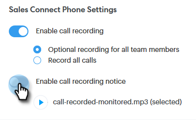

# Inställningar för dubbelpartsgodkännande {#two-party-consent-settings}

För att säkerställa att USA:s tvåpartslagar följs när du spelar in samtal kan du som administratör aktivera ett inspelat meddelande som du väljer att spela upp i början av dina samtal när det spelas in.

>[!PREREQUISITES]
>
>Innan du följer stegen nedan måste du [aktivera samtalsinspelning](/help/marketo/product-docs/marketo-sales-connect/phone/enable-call-recording.md).

1. Klicka på ikonen Inställningar och välj **Inställningar**.

   

1. Under Administratörsinställningar klickar du på **Allmänt**.

   

1. Bläddra nedåt till telefoninställningar för Sales Connect och klicka på **Hantera inspelningsmeddelande**.

   

1. Klicka **Importera inspelning**.

   

   >[!NOTE]
   >
   >Endast Wav- och MP3-filer stöds. Du kan inte överföra en fil som är längre än 30 sekunder.

1. Välj önskad ljudfil på hårddisken.

   

1. När överföringen är klar väljer du punkten (tre punkter) i filhanteraren och klickar på **Markera som meddelande om samtycke**. Klicka **OK** när det är klart.

   

1. Klicka på växlingsknappen för att aktivera att det markerade meddelandet spelas upp i början av dina inspelade samtal.

   
