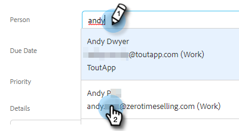

# Skapa och tilldela påminnelseuppgifter {#create-and-assign-reminder-tasks}

Påminnelseuppgifter är ett bra sätt att hålla sig à jour med kundengagemang och engagemang hos potentiella kunder. Följ de här stegen för att skapa en uppgift.

1. Klicka **Kommandocentral**.

   

1. Aktiviteter öppnas som standard. Klicka **Lägg till uppgift**.

   

1. Välj uppgiftstyp från E-post, Ring upp, InMail eller Anpassad uppgift.

   

1. Ge aktiviteten ett namn.

   

1. Välj att behålla uppgiften som tilldelats dig själv eller välj en annan användare att tilldela uppgiften till.

   

1. Lägg till den person du följer med med den här påminnelseaktiviteten.

   

1. Välj förfallodatum för uppgiften.

   

1. Välj uppgiftens prioritet.

   

1. Lägg till information om den uppgift som du vill ska vara tillgänglig när du slutför uppgiften, t.ex. samtalsanteckningar, en mall för InMail-meddelanden eller anteckningar om personen. Klicka **Skapa** när det är klart.

   
