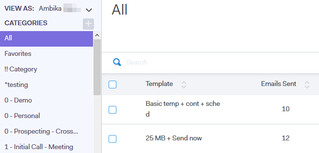

# Visa malllista som en annan användare {#view-template-list-as-another-user}

Som administratör kan du visa mallar som alla användare.

>[!NOTE]
>
>**Administratörsbehörigheter krävs**

1. Klicka **Mallar**.

   

1. Klicka på **Visa som** och välj önskad användare.

   

1. Du visar nu mallar som vald användare.

   

   >[!NOTE]
   >
   >Du kan också använda filter eller sökfunktionen tillsammans med Visa som för att visa vad som är viktigast för dig.
