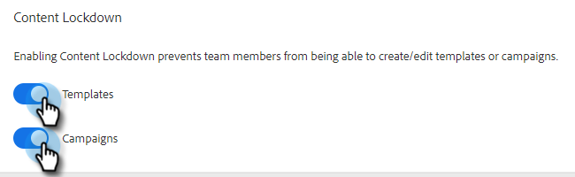

# Låsning av innehåll {#content-lockdown}

Genom att aktivera låsning av innehåll kan du hindra användare som inte är administratörer från att redigera mallar och/eller kampanjer. Användarna kan inte: dela, klona, redigera eller ta bort innehåll. De har inte heller möjlighet att arkivera mallar.

>[!NOTE]
>
>Användarna kan fortfarande redigera innehållet i ett e-postmeddelande när de skickar eller när de startar en kampanj.

1. I [webbprogram](https://toutapp.com/login), klicka på kugghjulsikonen och välj **Inställningar**.

   

1. Under Administratörsinställningar klickar du på **Allmänt**.

   

1. Bläddra nedåt till Innehållslåsning. Om du aktiverar något av skjutreglagen inaktiveras möjligheten för teammedlemmarna att skapa/redigera mallar och/eller kampanjer.

   
